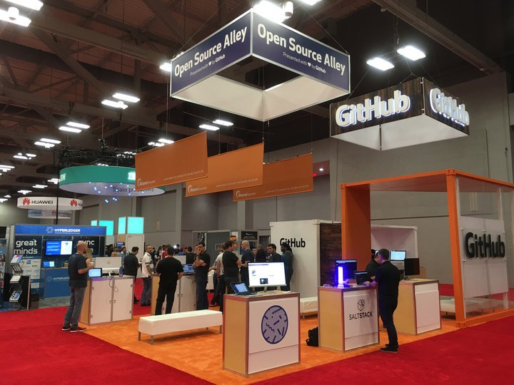
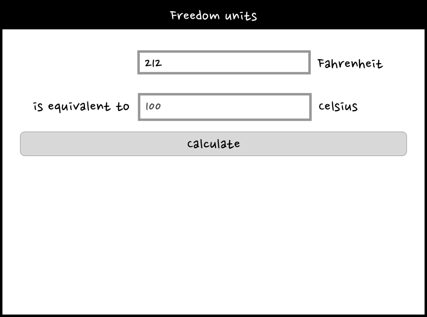
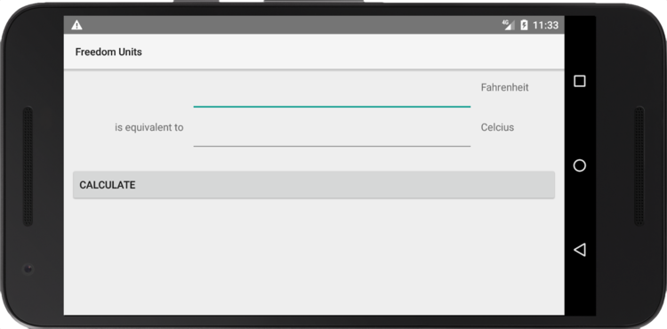
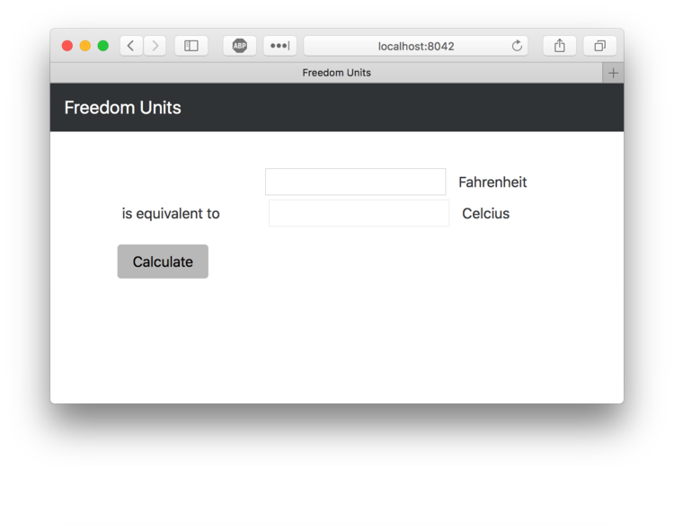
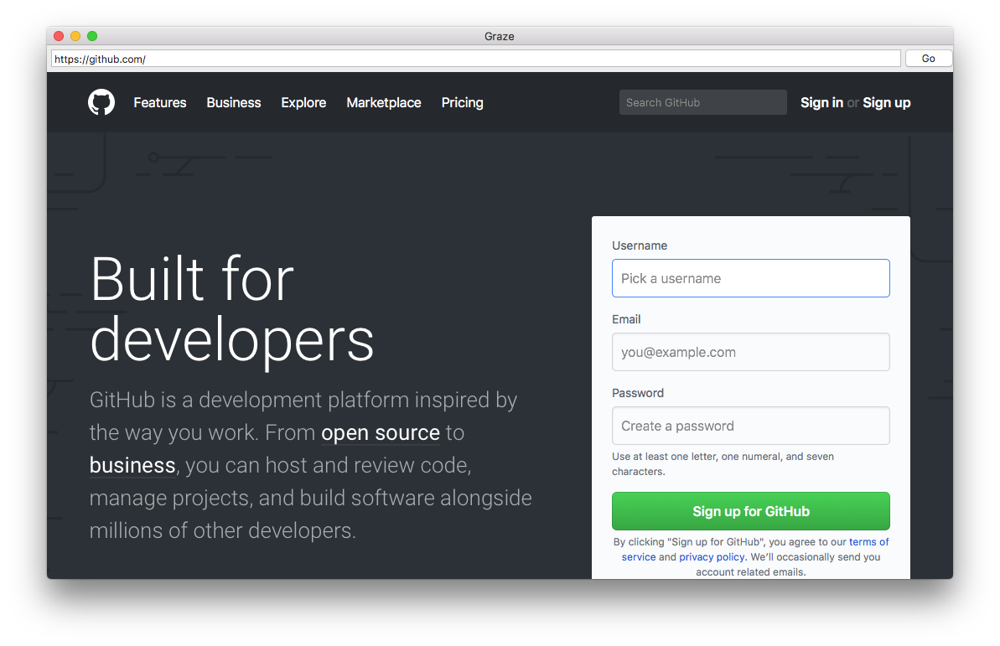
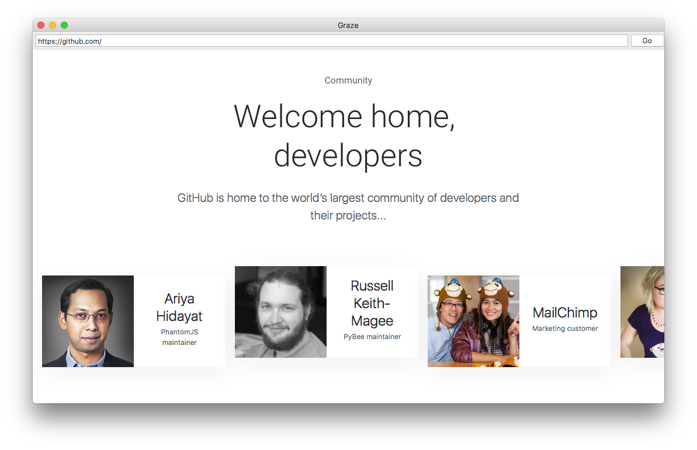
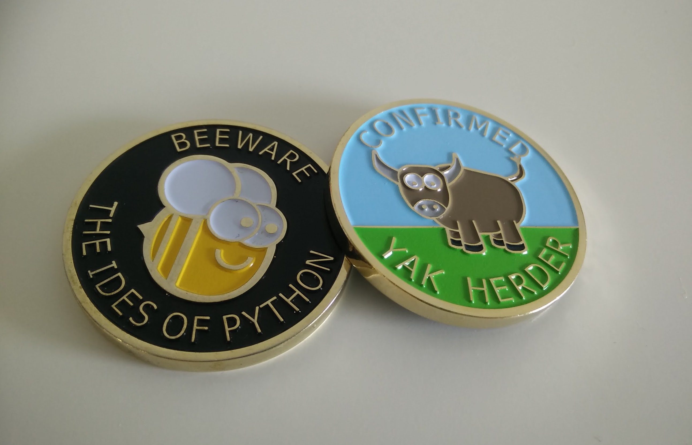
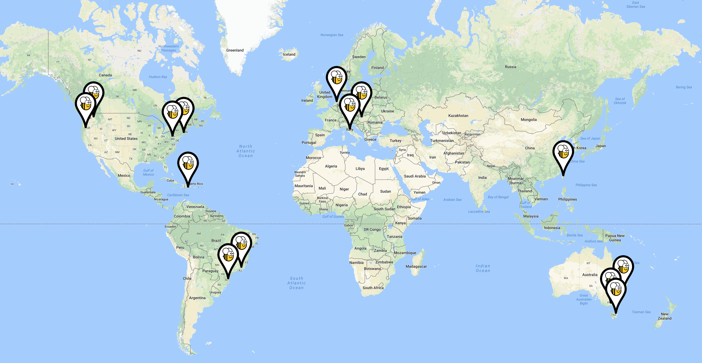
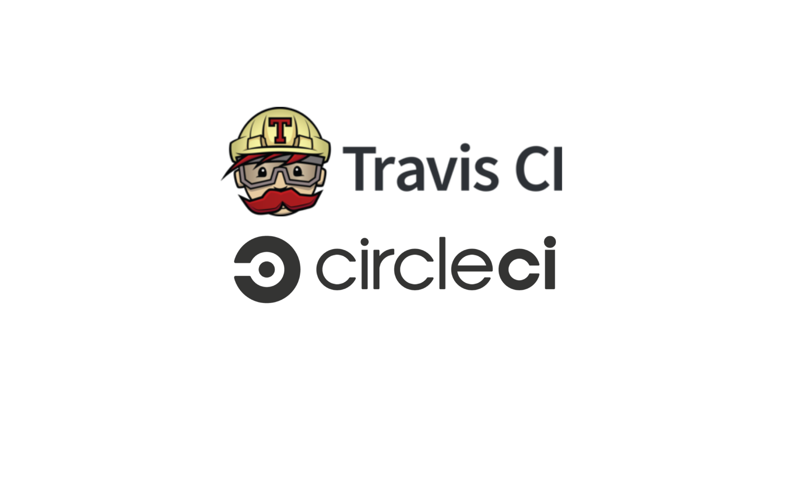

background-image: url(images/test-pattern.png)

???
---
class: title

# ...Bees?
## GitHub Constellation, Sydney

## katie@glasnt.com


???

---


???

I want to start off by pointing out smething pretty cool

One thing Daniel didn't mention on the github website

Here's the github homepage. It's what you see when you're not logged in. 

But if you scroll down

---


???

you get to this community section. And listed there, is a guy called Russell

---


???

Russell runs this little project called BeeWare. 

Bees!

---



???

Back in May, GitHub ran an Open Source Alley at OSCON. For half a day, open source projects could get a table at their booth to showcase their project, and a time slot to give a short presentation on their project

---


???

Beeware was fortunate enough to be one of these projects, and we were able to showcase our work and share what our project is all about

---
class: title


???

Beeware is series of application libraries, tools and widgets that let you right native cross platofrm applications in python

Consider the conundrum: you want to write an app

You're an australian developer working with americans, and they keep telling you the temperative in farenheight, but you are more familiar with Celsius. 

So you want to build a temperature converter

---



???

So here's the mockup of the app. We have a field where we enter the temp in degress farenheight, and then a field which shows us the temp in degrees celcius. Press the buttom, and the value is calculated and placed in the celcius field. 

So we know what we want our app to do, but how do we go about writing it?

Well it depends what platform we wantt o target. 

---
class: title


???

If you want a web app, you're going to have to use Javascript, html, and some css for styling

If you want to build an iphone app, you're going to need SWIFT

If you want an andoird app you're going to need java

And if you wanted your app to not just be client side, but server driven, you're going to need python, or something similar. 

And that's not even considering if you want a native desktop application on Windows or Linux

---
class: title


???

This is where beeware comes in. Instead of having to learn half a dozen rpogramming languages and markup dialects, we can just use one. 

---

class: title
# github.com/python/cpython


???

And it's all in python. 

Why python?

Python is a highly versitile language. Accessible to newcomers, but with enough grunt for the heavy lifting, powering sites like Instagram

It's desgined for teaching, works on every platform, and it's free and open source software


Fun fact: python has recently migrated to GitHub from a self-hosted mercurial repository


---

class: title
# github.com/pybee/toga


???

To see just how beeware works, here's an example application built in Toga

(NO PUN)

Toga is a widget toolkit. We define an application with widgets declared by toga, and when it comes time to run the code on the host platform, we use the toga abstraction to call the base widgets. 

Apple buttons on iOS, Android buttons on android, and so on. 

The reason to do all of this is that we want our apps to look like they belong. 

We want our apps to look and feel native.  

If any user can tell that the app they're using is made with beeware, we've failed. 

Your end user shouldn't care what your app is written in. They jsut want to use the thing. 

---
```python
import toga

class Freedom(toga.App):
  def calculate(self, widget):
    try:
      self.c_input.value = (float(self.f_input.value) - 32.0) * 5.0 / 9.0
    except Exception:
      self.c_input.value = '???'

  def startup(self):
    self.main_window = toga.MainWindow(self.name)
    self.main_window.app = self

    c_box = toga.Box()
    f_box = toga.Box()
    box = toga.Box()

    self.c_input = toga.TextInput(readonly=True)
    self.f_input = toga.TextInput()
    # ...
```

???

Speaking of thing, here is out thing!

(GLOSS OVER, NO FULL TECH)

---
### &nbsp;
```python
    # ...
    c_label = toga.Label('Celcius')
    f_label = toga.Label('Fahrenheit')
    join_label = toga.Label('is equivalent to')

    button = toga.Button('Calculate', on_press=self.calculate)

    # .. styling ..

    f_box.add([self.f_input, f_label])
    c_box.add([join_label, self.c_input, c_label])
    box.add([f_box, c_box, button])

    self.main_window.content = box
    self.main_window.show()

def main():
  return Freedom('Freedom', 'org.pybee.freedom')

```
---
# &nbsp;
```shell
$ pip install toga
$ python -m freedom
```
---
# &nbsp;
```shell
$ pip install toga
$ python -m freedom
```


---
# &nbsp;
# github.com/pybee/briefcase


???

To be able to take our app away with us takes a little bit more work. 

This is where briefcase comes in

Briefcase helps us pack up our applications in a way we can transport them around. 

There's a little bit of template work required before we can get there, thogh. 

Thankfully, we have a app that can help us here. 


---

# &nbsp;
# github.com/audreyr/cookiecutter


???

At beeware we don't just shave bespoke tibettan yaks. We are more than happy to take use store-bought yaks, and we contribute back financially.

This is the case with cookiecutter

With cookiecutter, you can easily create a template with replacement fields to create a structure for your app, project, receipe, anything you like


---

# &nbsp;
```bash
$ pip install cookiecutter briefcase
$ cookiecutter https://github.com/pybee/briefcase-template

app_name [appname]: freedom
formal_name [App Name]: Freedom
description [An app that does lots of stuff]: Units
author [Jane Developer]: Katie
author_email [jane@example.com]: katie@glasnt.com
bundle [com.example]: org.pybee
# ...

$ cp freedom.py freedom/app.py
```

???

DONT BUNDLE
---
# &nbsp;
```shell 
$ python setup.py macos -s
```


???

And it runs on your mac

---
class: title

---

# &nbsp;
```shell 
$ python setup.py ios -s
```


???

Run it with ios, and it runs on your iPhone 
---
# &nbsp;
```shell 
$ python setup.py android -s
```

---
# &nbsp;
```shell 
$ python setup.py linux -s
```

---
# &nbsp;
```shell 
$ python setup.py windows -s
```

---
# &nbsp;
```shell 
$ python setup.py django -s
```

---
class: title

???

Ta da!
 
but what else can we do?
---

class: title

# More widgets, more possibilities

???

The more widgets you have, more than just fields and buttons

---

```python
import toga
from colosseum import CSS

class Graze(toga.App):
    def startup(self):
        self.main_window = toga.MainWindow(self.name)
        self.main_window.app = self

        self.webview = toga.WebView()
        self.url_input = toga.TextInput(initial='https://github.com/')
        # ... 
        self.webview.url = self.url_input.value
        self.main_window.show()

    def load_page(self, widget):
        self.webview.url = self.url_input.value

if __name__ == '__main__':
    app = Graze('Graze', 'org.pybee.graze')
    app.main_loop()
```
---
```shell
$ python graze.py
```

 

---
```shell
$ python graze.py
```

 

---
```shell
$ python setup.py django -s
```

---
```shell
$ python setup.py django -s
```
 

???

Browser in a browser

---
class: title
## Another example

# This presentation

### Yes, really. 

???

Really :)


github.com/pybee/podium

---


---
class: title

# github.com/pybee/podium


---
class: title

???

Ta da!

Here's the thing so. 

This is only part of the beeware story

It's not just code. 

---
class: title
# ... Bees?

???

Bees. 

---

class: title

# Apiarists tend to bees

???

Our nomclemcure about different levels of members is just as fun as our project names

A bee is anyone that works on the project. Core team members tend to the bees, so they're apiarists. 

---
class: title
# Bees need to learn somewhere

???


For anyone who knows github like the back of their hand, they don't bat an eyelid when they come across a bit
of code that needs a fix

They know exactly how to get to github

get to the code repo

create a fork

clone the fork to their local machine

create a branch

make a commit

push the branch to their fork

and create a pull request based on their branch

---
class: title
# Bees need to learn somewhere

???

And sure, there's documentation on github about all these concepts

but there's nothing like actually sitting down with someone to learn this for the first time

Pair programming for someone just starting out, who doesn't know where to look, or how to describe the things they want to know about, is an absolute treasure

If you're lucky enough to be already working in a dev job with a senior programmer that is willing to do this sort of thing, then good for you

But if you don't have that, you're stuck fumbling around. 


---
class: title

# Sprints

???

This is why we run sprints

I'm using the term sprint here not in an agile sense, but in the Python-world term

At python and django conferences, after say, 1 day of workshops and a few days of talks, organisers will normally hold onto some of the conference space, or a nearby venue, kitted out with power and internet, and let attendees use the space for a few days after the event as a hacking space

The time is normally unstructured, but it's an absolutely amazing feature of many of the conferences I attend

You've spent a few days meeting new people and listneing to talks, and your brain is swarming with ideas. I mean, you've travelled how far to be with these people, so why not take advantage of their physical locality?

Why not use the days immiedately following to take a look at that new python trick you learnt about, or help out with a project you're interested in while the people from that project are around

---

class: title

# Apiarists tend to bees

???

This is something that we the beeware team have found to be amazing, not just for introducing people to our project and gaining contributors, both just at sprints and longer term, but also introducing first timers to open source contribution in general

One of the first sprints we ran, I remember a young woman started with having to create her own github account, and by next day, she was not only submitting PRs, but also helping other people around her with the GitHub basics. 

---

class: title

## ... with just a little incentive.

???

And sure, some people are happy to do this out of the kindness of their hearts. 

Some do it because they want to help teach the new generation

Some for those little green squares on their github profile

But at beeware, we have something a bit more substantial

---


???

Thanks to generous funding from MaxCDN and RevSys, we've made challenge coins

Anyone who contributes to beeware gets a nice shiny

The A side has Tibirius with Confirmed Yak Shaver, and the B side has Brutus with the project name and tag line

Any contributions count. It doesn't have to be code

We've given out coins for people giving talks on beeware, helping fix our tutorials, giving us marketing and fundraising advise, and so much more. 


---

class: title

# Rewards for helping those shave

???

Not only that. with thanks to github for the funding for the coin pressing, we have a second coin
---



???

The yak herder coin is for those that help other people earn their yak shaver coin

We've given this out to those who help other bees at sprints, our apiarists who are always helping review pull requests, and the like

---


???

As part of conferences apiarists have spoken at, we've run sprints all over the world, on five continents

These sprints are normally minimum two days, so it takes some time for first time contributors to get up to speed with the project, setting up their environment, and working out what they want to work on and submitting their first PR

So depending on the size of our sprint, can look like this


---

class: title


???

A few issues, but Pull Requests. Lots of pull request. Many many pull requests. 

For every PR we have, we run a bunch of tests. Our tests take a while. I think all of these PRs are from a project called Batavia. 

Batavia is an implementation of the CPython intepreter in Javascript

It lets us run python in the browser. 

So, we need to test it. A lot. Every permutation of every operation while unit testing, and a bunch of full tests

We take some python code, run it through CPython, and run it through our implemetnation, and check the outputs are identical

We do that 10,000 times. It takes a while, even with a whole bunch of tweeks to make it go faster. 

---
class: title


???

There are a bunch of services that offer free plans for continuous integration testing, such as Travis and Circle CI

However, their base level plans only offer a certain amount of concurrency

Now, these services are great. For smaller projects, they're wonderful. But, when we have a sprint... I'm not saying we've broken these services with our sheer amount of tests running, but I know that the entire website was boggy at least once. 

Now, both these companies have been great. They have plans which allow you to increase your testing capacity, but these are static increases. We run a sprint every couple of months. We're an open source project, we don't have the money to pay for kit that isn't being used most of the time. 

Both Travis and Circle have been amazing and temporarily bumped up our capacity once or twice when we've asked really nicely, which helps, but it's not enough. 

So we built our own. 

---

class: title
# github.com/pybee/beekeeper


???

Beekeeper is our system for tending to bees

Like Travis or Circle CI, for your project you define what tests you want to run, and you integrate the project to your CI system using GitHub web hooks. Any time someone creates or edits a Pull Request, Github sends a webhook, which we listen for, and we run the tests based on the code in the PR

You can setup beekeeper yourself using AWS's container service, editing your configurations to suit, using profiles so that some of your tests can use bigger containers as you will. 

All we're doing is just telling the system that "Hey, you have a script to run" and it goes and runs it

We can scale up the amount of instances in the worker pool during sprints, and when we don't have sprints, we can use only free-tier containers so we have a very small cost in the off season, while we can still run the occasional test. 


---

class: title
# pybee.org
## @pybeeware

???

If you are intersted in what we're doing with beeware, you can find out more on our website, pybee.org, or on twitter, where we post what we're up to, and retweet cute pictures of bees. 


---

class: title
# &nbsp;


???

And if you're interested in coming to a development sprint, we'll be at two open source events in Sydney in the next few months

Linux conf Austalia is on in January, tickets available now, and while it doesn't have sprints, do let us know if you're coming along and we can do a mini sprint. 


And as we have for the past few years now, we'll be running sprints at PyCon Austarlia, the national Python language conference, in August next year. 

---


class: title


???

BeeWare is still a work in progress, and we'd appreciate any help, either develpoment time or financially, to get the framework into a state where it can be the go to open source way to write native cross platform apps. 

---
class: title

# Thank you!

# 🐝

???
