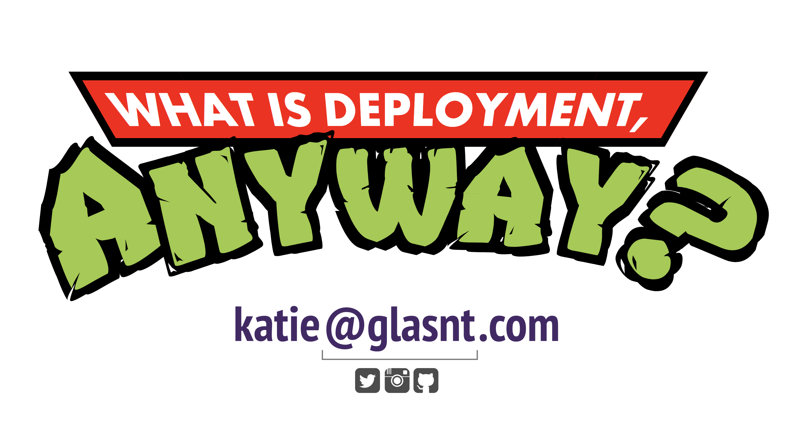
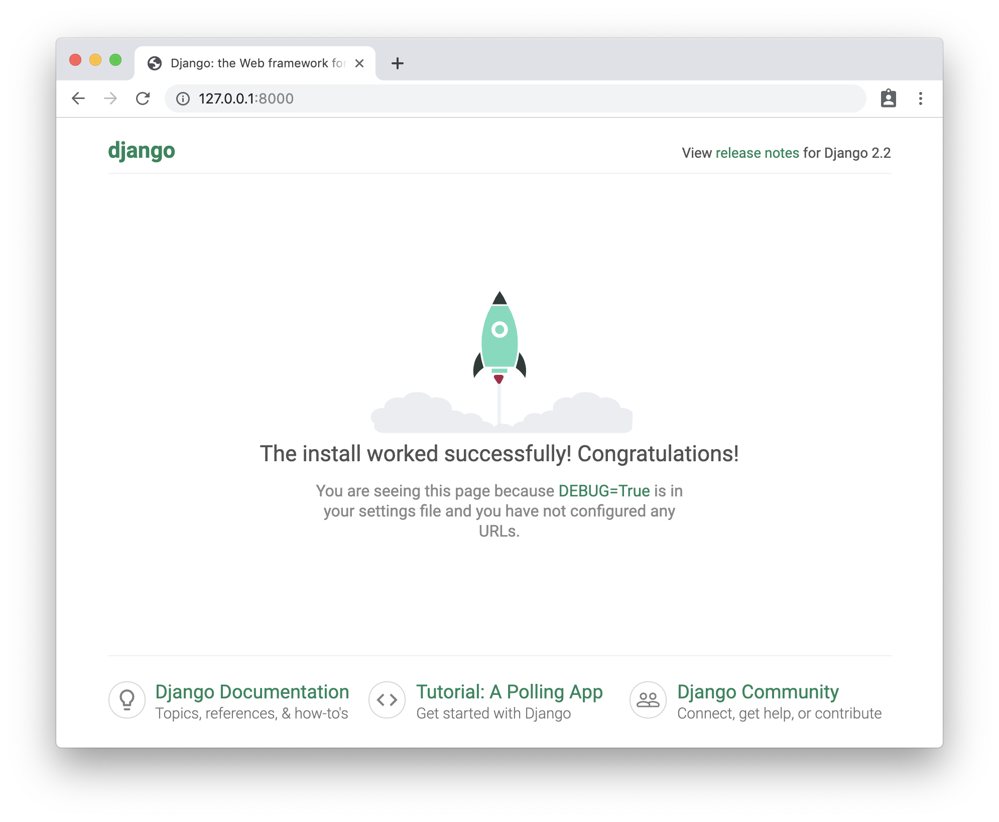

class: title
#  .thick[What is deployment, anyway?]
## .thick[PyGotham 2019]

???

breathe, Katie!

You got this

# 💪
---

???
Hi! I'm katie, and this isn't the talk you're expecting.

---

class: title
## .thin[What this talk isn't.]

???
this isn't a talk about "the way" to deploy your django app
this is a cursory overview of the state of the world as it is today

TODO: ENSURE SLIDE ACCURATLY REFLECTS SCOPE

In essense,

---

class: title
# .thin[What .b[is] deployment, anyway?]

???
We'll discuss, well ,what is deployment, anyway?

For our context today

---
  
# .prokyon[django] 2.2.5
# .flux[python] 3.7.4

???

the versions I'm targetting today are specifically django 2.2.5 and python 3.7.4

If you're joining me on YouTube from the year 2027, I'm sorry, things have changed since, but hopefully you find value in this talk!

--
## no extra addons

???

we're also just going to stick to base django

No addons, no cookiecutter templates. This talk should be useful if you're anywhere from looking at django

to having your djangogirls tutorial project working on your laptop

to a more complex setup, but no extra complexities.

TODO: is "addons" the best word here?

---

class: title
## Let's go!

???

so let's get started!

---

bash

<ps>myrtle</ps> <dr>~/git/glasnt/ $</dr>
<w>&nbsp;</w>
---

bash

<ps>myrtle</ps> <dr>~/git/glasnt/ $</dr>
pip install django<w>&nbsp;</w>
---

bash

<ps>myrtle</ps> <dr>~/git/glasnt/ $</dr>
pip install django 
Collecting django 
... 
Successfully installed django-2.2.5 
<ps>myrtle</ps> <dr>~/git/glasnt $</dr>
<w>&nbsp;</w>
---

bash

<ps>myrtle</ps> <dr>~/git/glasnt/ $</dr>
pip install django 
Collecting django 
... 
Successfully installed django-2.2.5 
<ps>myrtle</ps> <dr>~/git/glasnt $</dr>
django-admin startproject myproject<w>&nbsp;</w>
---

bash

<ps>myrtle</ps> <dr>~/git/glasnt/ $</dr>
pip install django 
Collecting django 
... 
Successfully installed django-2.2.5 
<ps>myrtle</ps> <dr>~/git/glasnt $</dr>
django-admin startproject myproject 
<ps>myrtle</ps> <dr>~/git/glasnt $</dr>
<w>&nbsp;</w>
---

bash

<ps>myrtle</ps> <dr>~/git/glasnt/ $</dr>
pip install django 
Collecting django 
... 
Successfully installed django-2.2.5 
<ps>myrtle</ps> <dr>~/git/glasnt $</dr>
django-admin startproject myproject 
<ps>myrtle</ps> <dr>~/git/glasnt $</dr>
cd myproject<w>&nbsp;</w>
---

bash

<ps>myrtle</ps> <dr>~/git/glasnt/ $</dr>
pip install django 
Collecting django 
... 
Successfully installed django-2.2.5 
<ps>myrtle</ps> <dr>~/git/glasnt $</dr>
django-admin startproject myproject 
<ps>myrtle</ps> <dr>~/git/glasnt $</dr>
cd myproject 
<ps>myrtle</ps> <dr>~/git/glasnt/myproject $</dr>
<w>&nbsp;</w>
---

bash

<ps>myrtle</ps> <dr>~/git/glasnt/ $</dr>
pip install django 
Collecting django 
... 
Successfully installed django-2.2.5 
<ps>myrtle</ps> <dr>~/git/glasnt $</dr>
django-admin startproject myproject 
<ps>myrtle</ps> <dr>~/git/glasnt $</dr>
cd myproject 
<ps>myrtle</ps> <dr>~/git/glasnt/myproject $</dr>
ls -R<w>&nbsp;</w>
---

bash

<ps>myrtle</ps> <dr>~/git/glasnt/ $</dr>
pip install django 
Collecting django 
... 
Successfully installed django-2.2.5 
<ps>myrtle</ps> <dr>~/git/glasnt $</dr>
django-admin startproject myproject 
<ps>myrtle</ps> <dr>~/git/glasnt $</dr>
cd myproject 
<ps>myrtle</ps> <dr>~/git/glasnt/myproject $</dr>
ls -R 
.: 
manage.py myproject 
 
./myproject: 
⎽⎽init__.py settings.py urls.py wsgi.py 
<ps>myrtle</ps> <dr>~/git/glasnt/myproject $</dr>
<w>&nbsp;</w>
---

bash

<ps>myrtle</ps> <dr>~/git/glasnt/myproject $</dr>
<w>&nbsp;</w>
---

bash

<ps>myrtle</ps> <dr>~/git/glasnt/myproject $</dr>
python manage.py runserver<w>&nbsp;</w>

???

so we can just runserver, right?
---

bash

<ps>myrtle</ps> <dr>~/git/glasnt/myproject $</dr>
.noop[p]ython manage.py runserver 
Watching for file changes with StatReloader 
Performing system checks... 
System check identified no issues (0 silenced).  
.rf[You have 17 unapplied migration(s). Your project may not work properly until you apply the migrations for app(s): admin, auth, contenttypes, sessions. Run 'python manage.py migrate' to apply them.]<br   October 04, 2019 - 17:05:24 
Django version 2.2.5, using settings 'myproject.settings' 
Starting development server at http:.noop[/]/127.0.0.1:8000/ 
Quit the server with CONTROL-C. 
<w>&nbsp;</w>
???

oh, nope, big red error.

---

bash

<ps>myrtle</ps> <dr>~/git/glasnt/myproject $</dr>
.noop[p]ython manage.py runserver 
Watching for file changes with StatReloader 
Performing system checks... 
System check identified no issues (0 silenced).  
.rf[You have 17 unapplied migration(s). Your project may not work properly until you apply the migrations for app(s): admin, auth, contenttypes, sessions. Run .red['python manage.py migrate'] to apply them.]<br   October 04, 2019 - 17:05:24 
Django version 2.2.5, using settings 'myproject.settings' 
Starting development server at http:.noop[/]/127.0.0.1:8000/ 
Quit the server with CONTROL-C. 
<w>&nbsp;</w>

???

oh yay, big red error with a helpful command!

---

bash

<ps>myrtle</ps> <dr>~/git/glasnt/myproject $</dr>
.noop[p]ython manage.py runserver 
Watching for file changes with StatReloader 
Performing system checks... 
System check identified no issues (0 silenced).  
.rf[You have 17 unapplied migration(s). Your project may not work properly until you apply the migrations for app(s): admin, auth, contenttypes, sessions. Run 'python manage.py migrate' to apply them.]<br   October 04, 2019 - 17:05:24 
Django version 2.2.5, using settings 'myproject.settings' 
Starting development server at http:.noop[/]/127.0.0.1:8000/ 
Quit the server with CONTROL-C. 
<ps>myrtle</ps> <dr>~/git/glasnt/myproject $</dr>
<w>&nbsp;</w>

???

okay, cancel out of that..
---

bash

<ps>myrtle</ps> <dr>~/git/glasnt/myproject $</dr>
.noop[p]ython manage.py runserver 
Watching for file changes with StatReloader 
Performing system checks... 
System check identified no issues (0 silenced).  
.rf[You have 17 unapplied migration(s). Your project may not work properly until you apply the migrations for app(s): admin, auth, contenttypes, sessions. Run 'python manage.py migrate' to apply them.]<br   October 04, 2019 - 17:05:24 
Django version 2.2.5, using settings 'myproject.settings' 
Starting development server at http:.noop[/]/127.0.0.1:8000/ 
Quit the server with CONTROL-C. 
<ps>myrtle</ps> <dr>~/git/glasnt/myproject $</dr>
python manage.py migrate<w>&nbsp;</w>
---

bash

.cf[Operations to perform:] 
&nbsp; .tb[Apply all migrations:] admin, auth, contenttypes, sessions 
.cf[Running migrations:] 
&nbsp; Applying contenttypes.0001_initial... .gf[OK] 
&nbsp; Applying auth.0001_initial... .gf[OK] 
&nbsp; Applying admin.0001_initial... .gf[OK] 
&nbsp; Applying admin.0002_logentry_remove_auto_add... .gf[OK] 
&nbsp; Applying admin.0003_logentry_add_action_flag_choices... .gf[OK] 
&nbsp; Applying contenttypes.0002_remove_content_type_name... .gf[OK] 
... 
&nbsp; Applying auth.0009_alter_user_last_name_max_length... .gf[OK] 
&nbsp; Applying auth.0010_alter_group_name_max_length... .gf[OK] 
&nbsp; Applying auth.0011_update_proxy_permissions... .gf[OK] 
&nbsp; Applying sessions.0001_initial... .gf[OK] 
<ps>myrtle</ps> <dr>~/git/glasnt/myproject $</dr>
<w>&nbsp;</w>
???

oh wow, that's a lot of output.

has anything changed?
---

bash

<ps>myrtle</ps> <dr>~/git/glasnt/myproject $</dr>
<w>&nbsp;</w>
---

bash

<ps>myrtle</ps> <dr>~/git/glasnt/myproject $</dr>
ls -R<w>&nbsp;</w>

---

bash

<ps>myrtle</ps> <dr>~/git/glasnt/myproject $</dr>
ls -R 
.: 
db.sqlite3 manage.py myproject 
 
./myproject: 
__init__.py settings.py urls.py wsgi.py 
<ps>myrtle</ps> <dr>~/git/glasnt/myproject $</dr>
<w>&nbsp;</w>

---

bash

<ps>myrtle</ps> <dr>~/git/glasnt/myproject $</dr>
ls -R 
.: 
.red[db.sqlite3] manage.py myproject 
 
./myproject: 
__init__.py settings.py urls.py wsgi.py 
<ps>myrtle</ps> <dr>~/git/glasnt/myproject $</dr>
<w>&nbsp;</w>
???

oh sweet, we have a database.. I guess, based on that name.

---

bash

<ps>myrtle</ps> <dr>~/git/glasnt/myproject $</dr>
<w>&nbsp;</w>

???

Okay. Let's clear that away.

---

bash

<ps>myrtle</ps> <dr>~/git/glasnt/myproject $</dr>
python manage.py runserver<w>&nbsp;</w>

???

will my project run now?
---

bash

<ps>myrtle</ps> <dr>~/git/glasnt/myproject $</dr>
.noop[p]ython manage.py runserver 
Watching for file changes with StatReloader 
Performing system checks...  
System check identified no issues (0 silenced). 
 October 04, 2019 - 17:05:54 
Django version 2.2.5, using settings 'myproject.settings' 
Starting development server at http:.noop[/]/127.0.0.1:8000/ 
Quit the server with CONTROL-C. 
<w>&nbsp;</w>

???

Oh neat, no more error.
---

bash

<ps>myrtle</ps> <dr>~/git/glasnt/myproject $</dr>
.noop[p]ython manage.py runserver 
Watching for file changes with StatReloader 
Performing system checks...  
System check identified no issues (0 silenced). 
 October 04, 2019 - 17:05:54 
Django version 2.2.5, using settings 'myproject.settings' 
Starting development server at .red[http:.noop[/]/127.0.0.1:8000/] 
Quit the server with CONTROL-C. 
<w>&nbsp;</w>

???

and a helpful little message telling us where we're running
---
class: middle, center, image

???

sweet!

So now we know which bits we need
---
class: middle, center, image

???

and we have the much loved django admin

---
class: title
# .prokyon[django]
## very good local development setup

???

we can get our app running locally really well.
and here is why

---
runserver
https://docs.djangoproject.com/en/2.2/ref/django-admin/#runserver
do not run in production
---
> We're in the business of making Web frameworks, not Web servers
---
and also

viewsource

staticfiles
https://docs.djangoproject.com/en/2.2/howto/static-files/

do not use in production

---

run django
nnect <pre><code class="">to database</code></pre>
serve static files

---

run web framework
nnect <pre><code class="">to database</code></pre>
serve static files

???

very general for any web framework.

same for a lot of things, python, or any language.

---

<pre><code class="go">to layaercacke</code></pre>
---

---
class: title
#  Thanks!
