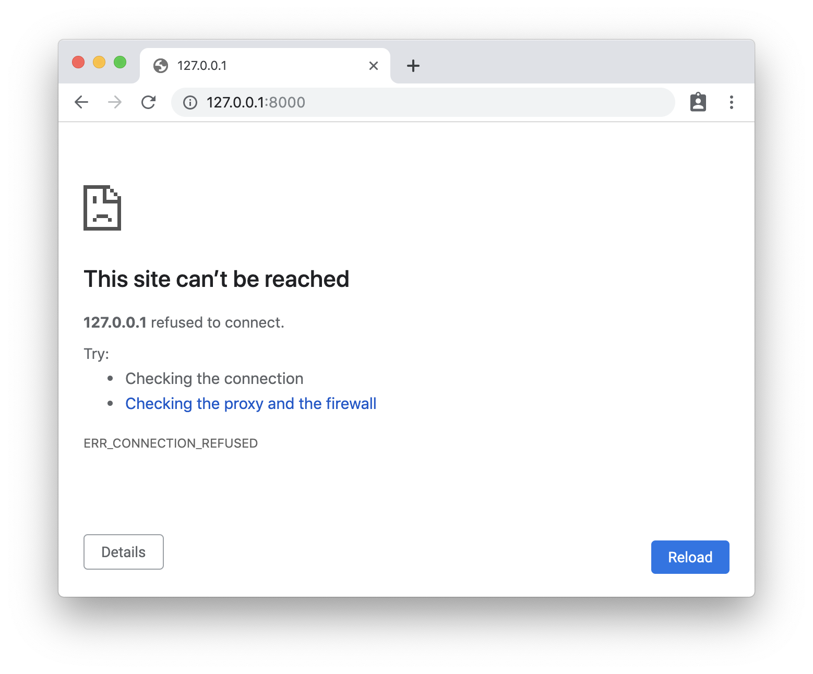
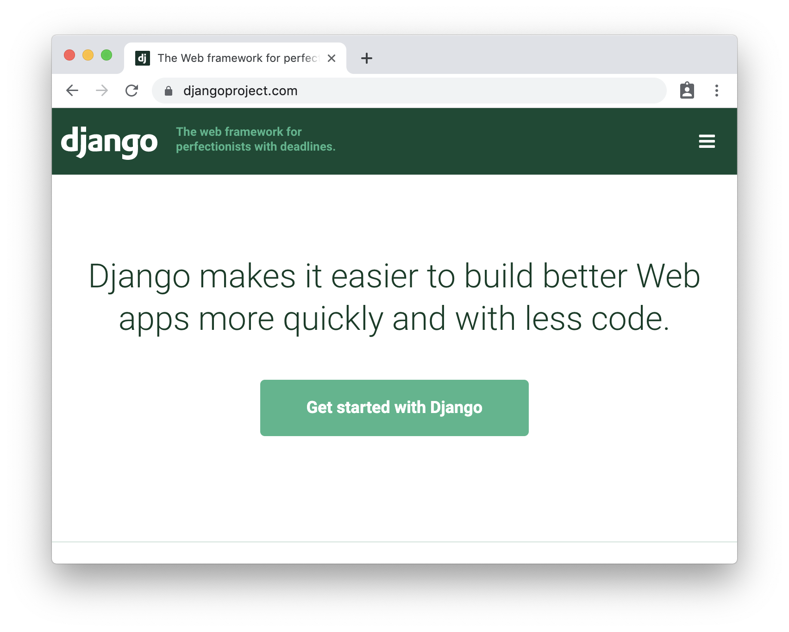
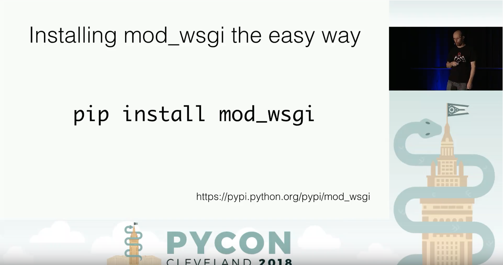
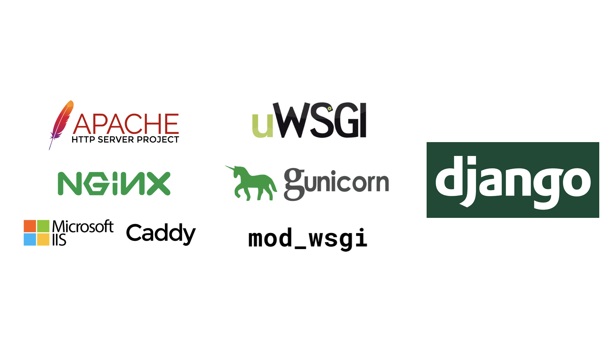

class: title
#  What is deployment, anyway?
## PyGotham 2019

???

breathe, Katie!

You got this

# 💪
---

???

this is What is deployment, anyway.
---

class: title
# .e[👋]

???

Hi! I'm katie
---

class: title
# .e[👩🏻‍🔧]

???

for the last 8 years, on and off, I've worked as a

systems administrator

automation engineer

operations engineer

site reliabiltiy engineer

For a bunch of different places, including web hosting providers.

It was my job to make sure not only did your website stay up, but also

if you paid enough money

---

class: title
# .e[⏰]

???

I'd get woken up in the middle of the night if your website was down.

Given that context.

---

class: title
# .e[👩🏼‍💻]

???

Today we're going to discuss how we can get your django app

---

class: title
# .e[☁️]

???

Onto the internet.

There's going to be a few major sections to that:

---

class: title
# .e[🦄 🏢 🚚]

???

A bit about how django works

Some of the current hosting options that are available

And how you get your website off your laptop and onto one of these hosting providers.

in other words, what, where and how

---

class: title
# .e[🦄]

???

chapter one. Django. The what.

If you've been to a djangogirls workshop or have ever otherwise built your own django application before, you would be familiar with

---

python3.7

<ps>myrtle</ps> <dr>~/my_project $</dr>
.noop[python] manage.py runserver 
Watching for file changes with StatReloader 
Performing system checks...  
System check identified no issues (0 silenced). 
October 5, 2019 - 13:06:37 
Django version 2.2.5, using settings 'my_project.settings' 
Starting development server at http:/.noop[/]127.0.0.1:8000/ Quit the server with CONTROL-C. 
[05/Oct/2019 13:06:42] "GET / HTTP/1.1" 200 193 
<w>&nbsp;</w>

???

a terminal that looks something like this.

---

python3.7

<ps>myrtle</ps> <dr>~/my_project $</dr>
.red[.noop[python] manage.py runserver] 
Watching for file changes with StatReloader 
Performing system checks...  
System check identified no issues (0 silenced). 
October 5, 2019 - 13:06:37 
Django version 2.2.5, using settings 'my_project.settings' 
Starting development server at http:/.noop[/]127.0.0.1:8000/ Quit the server with CONTROL-C. 
[05/Oct/2019 13:06:42] "GET / HTTP/1.1" 200 193 
<w>&nbsp;</w>

???

you would have run the command python manage.py runserver

---

python3.7

<ps>myrtle</ps> <dr>~/my_project $</dr>
.noop[python] manage.py runserver 
Watching for file changes with StatReloader 
Performing system checks...  
System check identified no issues (0 silenced). 
October 5, 2019 - 13:06:37 
Django version 2.2.5, using settings 'my_project.settings' 
.red[Starting development server at http:/.noop[/]127.0.0.1:8000/] Quit the server with CONTROL-C. 
[05/Oct/2019 13:06:42] "GET / HTTP/1.1" 200 193 
<w>&nbsp;</w>

???

which would have said it was starting a development server on port 8000

Which if you open up your web browser

---

class: middle, center, image

???

you can see your django site.

And that works fine for you.

the problem is that the djangogirl next to you

---
class: middle, center, image

???

she won't be able to see your website

This is because your website is running just on your laptop.

So what we need to do is Deploy it.

---

class: title
# "🦄 🚚 ☁️❓"

???

so I can just take a copy of what I have on my machine, and put it on the cloud, right?

Well, no.

There is one major issue.

---

python3.7

<ps>myrtle</ps> <dr>~/my_project $</dr>
.red[.noop[python] manage.py runserver] 
Watching for file changes with StatReloader 
Performing system checks...  
System check identified no issues (0 silenced). 
October 5, 2019 - 13:06:37 
Django version 2.2.5, using settings 'my_project.settings' 
Starting development server at http:/.noop[/]127.0.0.1:8000/ Quit the server with CONTROL-C. 
[05/Oct/2019 13:06:42] "GET / HTTP/1.1" 200 193 
<w>&nbsp;</w>

???

runserver

you know

that one that

---

python3.7

<ps>myrtle</ps> <dr>~/my_project $</dr>
.noop[python] manage.py runserver 
Watching for file changes with StatReloader 
Performing system checks...  
System check identified no issues (0 silenced). 
October 5, 2019 - 13:06:37 
Django version 2.2.5, using settings 'my_project.settings' 
Starting .red[development server] at http:/.noop[/]127.0.0.1:8000/ Quit the server with CONTROL-C. 
[05/Oct/2019 13:06:42] "GET / HTTP/1.1" 200 193 
<w>&nbsp;</w>

???

started a development server on your local machine.

---
class: middle, center, image

???

the django documentation clearly describes that you should not

---

class: middle, center, image

???

use this in a production setting.

It has not gone through security audits or performance tests.

And there's even a super helpful note.

And that’s how it’s gonna stay. We’re in the business of making Web frameworks, not Web servers, so improving this server to be able to handle a production environment is outside the scope of Django.

Which is a very important distinction.

---

class: middle, center, image

???

I mean, it says it right there at the top of any page.

---

background-image: url("images/django_framework_01_169.png")

???

django is the web framework for perfectionists with deadlines
---
background-image: url("images/django_framework_02_169.png")

???

emphasis on framework.

what we need, is a web server.

---

class: middle, center, image

???

there are a few major web servers that you may have heard mention of.

Apache, Nginx, or IIS (internet information server)
---
class: middle, center, image

.fix-tilt-long[.w[....]and&nbsp;more!]
???

they've all got new logos now, so maybe one of these versions is more familiar to you.

There's also Caddy now that's picking up steam

All these web servers talk HTTP

Hyper Text Transfer Protocol

as in

---
class: middle, center, image

???

that HTTP

The http you type into your browser.

---

class: title
# &nbsp;

???

but these web servers have a problem.

---

class: title
# .e[🐍❌]

???

they don't talk python. Not directly.

You need an interface that can talk to python and to a web server

---

class: title
# WSGI
## Web Server Gateway Interface
### &nbsp;

???

that's where w.s.g.i comes in. Or, "whis-gee".

---
class: title
# WSGI
## Web Server Gateway Interface
### `PEP-0333`, `PEP-3333`

???

there are PEPs - Python Enhancement proposals - which define

If your web framework (django) can talk WSGI, then you can use any wsgi server you like.

And thankfully, django supports wsgi

---

bash

<ps>myrtle</ps> <dr>~/my_project $</dr>
ls my_project/<w>&nbsp;</w>

???

if you check your python project

---

bash

<ps>myrtle</ps> <dr>~/my_project $</dr>
ls my_project/ 
⎽⎽init⎽⎽.py settings.py urls.py wsgi.py 
<ps>myrtle</ps> <dr>~/my_project $</dr>
<w>&nbsp;</w>

???

you'll see that you'll have

---

bash

<ps>myrtle</ps> <dr>~/my_project $</dr>
ls my_project/ 
⎽⎽init⎽⎽.py settings.py urls.py .red[wsgi.py] 
<ps>myrtle</ps> <dr>~/my_project $</dr>
<w>&nbsp;</w>

???

a convenient wsgi.py file.

---

bash

<ps>myrtle</ps> <dr>~/my_project $</dr>
ls my_project/ 
⎽⎽init⎽⎽.py settings.py urls.py wsgi.py 
<ps>myrtle</ps> <dr>~/my_project $</dr>
cat wsgi.py<w>&nbsp;</w>

???

which was automatically generated when you created your django project.

It'll contain
---

bash

<ps>myrtle</ps> <dr>~/my_project $</dr>
ls my_project/ 
⎽⎽init⎽⎽.py settings.py urls.py wsgi.py 
<ps>myrtle</ps> <dr>~/my_project $</dr>
cat wsgi.py 
import os  from django.core.wsgi import get_wsgi_application  os.environ.setdefault('DJANGO_SETTINGS_MODULE', 'my_project.settings')  application = get_wsgi_application() 
<ps>myrtle</ps> <dr>~/my_project $</dr>
<w>&nbsp;</w>

???

some template code that exposes the wsgi callable as a module-level variable named application.

This will be important later.

So we know django talks wsgi, so we can use one of the many wsgi servers

---

class: middle, center, image

.fix-tilt-long[.w[....]and&nbsp;more!]

???

there's ones like micro-wsgi or gunicorn.

These are super interesting in themselves, and there's a great many talks on them

---

class: middle, center, image

.footnotes[[Type UWSGI; Press Enter; What happens?](https://www.youtube.com/watch?v=YoUZIzPGKT8) DjangoCon US 2017]

???

Philip James gave a great talk about microwsgi at djangocon a few years ago.

---

class: middle, center, image

.footnotes[[Secrets of a WSGI master](https://www.youtube.com/watch?v=CPz0s1CQsTE), PyCon 2018]

???

There's also Graham Dumpleton's talk from PyCon Secrets of a wsgi master.

---

class: middle, center, image

???

so we have this whole mess of logos.

It's complicated.

So how do we actually deploy thing?

---

class: title
# .e[🏢]

???

chapter two

Infrastrucutre. The where.

Because if you choose the right kind of setup, you can ignore most of those logos.

I know.

---

class: title
# TODO

used to be physical servers
one per person
ale. <pre><code class="scala"></code></pre>
you'd have to worry about everything.

then virtual servers (iaas)
several per machine
you'd still have to worry about things, but not hardware

then platforms (paas)
heroku, pythonanywhere, divio
sepcific to a language

and now containers
as containers are now standardised

---

class: title
# .e[🚚]

???

chapter three

Deployment. The how.

---

class: title
# TODO

depends on which platform you selected

sometimes it's a manual copy and paste

services like python anywhere pull from yourt github

source control is a good idea

others can push from your github. webhooks!

but

there's your code
youer database
and your assets

---
class: title
#  Thanks!
