class: title
#  .thick[What is deployment, anyway?]
## .thick[PyCon 2020]

???

breathe, Katie!

You got this
# 💪

---
class: title
#  .thick[What is deployment, anyway?]
## .thick[PyCon 2020]

???
Hi! I'm katie, and this isn't the talk you're expecting.

---

class: title
## .thin[What this talk isn't.]

???
this isn't a talk about "the one true way" to deploy your app

I will express some opinions, giving you some background around some of those opinions

but mostly this is a review of the world as at 2019

This talk is diving into the complexities of deployment, in essense

---

class: title
# .thin[What .b[is] deployment, anyway?]

???
We'll discuss, well, what is deployment, anyway?

---
class: title
# .thin[What is .prokyon[django] deployment, anyway?]
???

and specifically within the context of deploying a django application.

But I'm choosing django here for a reason, which will become apparaent later.
---
class: title
# Points of interest
## out of the box .prokyon[django]
## complexities
## helpers

???

we'll be taking a journey today, so instead of an agenda, here are at least a few points of interest along our trip.

We'll start by looking at exactly what comes out of the box with django

and from there discuss the complexities django has compared to other frameworks when it comes to deployment

not the complications, just the complexities.

and discuss the helpers django has to assist you.

---
class: title
# .prokyon[django] 3.0.3
# .flux[python] 3.8.1

???

the versions I'm targetting today are specifically django 3.0.3 and python 3.8.1

If you're joining me on YouTube from the year 2027, I'm sorry, things have changed since, but hopefully you find value in this talk!

---
class: title
## no extra addons

???

we're also just going to stick to base django

No additional features, no task management, no other helpers

Just whatever comes in stock standard django

This talk should be useful if you're anywhere from looking at django

to having your djangogirls tutorial project working on your laptop

to a more complex setup, but no extra complexities.

---
     
## Let's look at .prokyon[django]
### as it comes out of the box

???

so let's get started, by taking a look at django as it comes out of the box

---

bash

<ps>myrtle</ps> <dr>~/git/glasnt $</dr>
<w>&nbsp;</w>
---

bash

<ps>myrtle</ps> <dr>~/git/glasnt $</dr>
pip install django<w>&nbsp;</w>
---

bash

<ps>myrtle</ps> <dr>~/git/glasnt $</dr>
pip install django 
Collecting django 
... 
Successfully installed django-3.0.3 
<ps>myrtle</ps> <dr>~/git/glasnt $</dr>
<w>&nbsp;</w>
---

bash

<ps>myrtle</ps> <dr>~/git/glasnt $</dr>
pip install django 
Collecting django 
... 
Successfully installed django-3.0.3 
<ps>myrtle</ps> <dr>~/git/glasnt $</dr>
django-admin startproject myproject<w>&nbsp;</w>

???

then we can run the super super helpful

stat project management command.

---

bash

<ps>myrtle</ps> <dr>~/git/glasnt $</dr>
pip install django 
Collecting django 
... 
Successfully installed django-3.0.3 
<ps>myrtle</ps> <dr>~/git/glasnt $</dr>
django-admin startproject myproject 
<ps>myrtle</ps> <dr>~/git/glasnt $</dr>
<w>&nbsp;</w>

???

and while this doesn't return any output

it did create a template project for us.
---

bash

<ps>myrtle</ps> <dr>~/git/glasnt $</dr>
pip install django 
Collecting django 
... 
Successfully installed django-3.0.3 
<ps>myrtle</ps> <dr>~/git/glasnt $</dr>
django-admin startproject myproject 
<ps>myrtle</ps> <dr>~/git/glasnt $</dr>
cd myproject<w>&nbsp;</w>

???

we can see it in the newly created 'myproject' folder.
---

bash

<ps>myrtle</ps> <dr>~/git/glasnt $</dr>
pip install django 
Collecting django 
... 
Successfully installed django-3.0.3 
<ps>myrtle</ps> <dr>~/git/glasnt $</dr>
django-admin startproject myproject 
<ps>myrtle</ps> <dr>~/git/glasnt $</dr>
cd myproject 
<ps>myrtle</ps> <dr>~/git/glasnt/myproject $</dr>
<w>&nbsp;</w>
---

bash

<ps>myrtle</ps> <dr>~/git/glasnt $</dr>
pip install django 
Collecting django 
... 
Successfully installed django-3.0.3 
<ps>myrtle</ps> <dr>~/git/glasnt $</dr>
django-admin startproject myproject 
<ps>myrtle</ps> <dr>~/git/glasnt $</dr>
cd myproject 
<ps>myrtle</ps> <dr>~/git/glasnt/myproject $</dr>
ls -R<w>&nbsp;</w>
---

bash

<ps>myrtle</ps> <dr>~/git/glasnt $</dr>
pip install django 
Collecting django 
... 
Successfully installed django-3.0.3 
<ps>myrtle</ps> <dr>~/git/glasnt $</dr>
django-admin startproject myproject 
<ps>myrtle</ps> <dr>~/git/glasnt $</dr>
cd myproject 
<ps>myrtle</ps> <dr>~/git/glasnt/myproject $</dr>
ls -R 
.: 
manage.py myproject 
 
./myproject: 
⎽⎽init__.py asgi.py settings.py urls.py wsgi.py 
<ps>myrtle</ps> <dr>~/git/glasnt/myproject $</dr>
<w>&nbsp;</w>
---

bash

<ps>myrtle</ps> <dr>~/git/glasnt/myproject $</dr>
<w>&nbsp;</w>
---

bash

<ps>myrtle</ps> <dr>~/git/glasnt/myproject $</dr>
python manage.py runserver<w>&nbsp;</w>

???

we can launch our app locally, using python manage.py runserver
---

bash

<ps>myrtle</ps> <dr>~/git/glasnt/myproject $</dr>
.noop[p]ython manage.py runserver 
Watching for file changes with StatReloader 
Performing system checks... 
System check identified no issues (0 silenced).  
.rf[You have 17 unapplied migration(s). Your project may not work properly until you apply the migrations for app(s): admin, auth, contenttypes, sessions. Run 'python manage.py migrate' to apply them.]<br  
Django version 3.0.3, using settings 'myproject.settings' 
Starting development server at http:.noop[/]/127.0.0.1:8000/ 
Quit the server with CONTROL-C. 
<w>&nbsp;</w>
???

but we get this error

---

bash

<ps>myrtle</ps> <dr>~/git/glasnt/myproject $</dr>
.noop[p]ython manage.py runserver 
Watching for file changes with StatReloader 
Performing system checks... 
System check identified no issues (0 silenced).  
.rf[You have 17 unapplied migration(s). Your project may not work properly until you apply the migrations for app(s): admin, auth, contenttypes, sessions. Run .red['python manage.py migrate'] to apply them.]<br  
Django version 3.0.3, using settings 'myproject.settings' 
Starting development server at http:.noop[/]/127.0.0.1:8000/ 
Quit the server with CONTROL-C. 
<w>&nbsp;</w>

???

oh yay, big red error with a helpful command!

---

bash

<ps>myrtle</ps> <dr>~/git/glasnt/myproject $</dr>
.noop[p]ython manage.py runserver 
Watching for file changes with StatReloader 
Performing system checks... 
System check identified no issues (0 silenced).  
.rf[You have 17 unapplied migration(s). Your project may not work properly until you apply the migrations for app(s): admin, auth, contenttypes, sessions. Run 'python manage.py migrate' to apply them.]<br  
Django version 3.0.3, using settings 'myproject.settings' 
Starting development server at http:.noop[/]/127.0.0.1:8000/ 
Quit the server with CONTROL-C. 
<ps>myrtle</ps> <dr>~/git/glasnt/myproject $</dr>
<w>&nbsp;</w>

???

okay, cancel out of that..
---

bash

<ps>myrtle</ps> <dr>~/git/glasnt/myproject $</dr>
.noop[p]ython manage.py runserver 
Watching for file changes with StatReloader 
Performing system checks... 
System check identified no issues (0 silenced).  
.rf[You have 17 unapplied migration(s). Your project may not work properly until you apply the migrations for app(s): admin, auth, contenttypes, sessions. Run 'python manage.py migrate' to apply them.]<br  
Django version 3.0.3, using settings 'myproject.settings' 
Starting development server at http:.noop[/]/127.0.0.1:8000/ 
Quit the server with CONTROL-C. 
<ps>myrtle</ps> <dr>~/git/glasnt/myproject $</dr>
python manage.py migrate<w>&nbsp;</w>
---

bash

.cf[Operations to perform:] 
&nbsp; .tb[Apply all migrations:] admin, auth, contenttypes, sessions 
.cf[Running migrations:] 
&nbsp; Applying contenttypes.0001_initial... .gf[OK] 
&nbsp; Applying auth.0001_initial... .gf[OK] 
&nbsp; Applying admin.0001_initial... .gf[OK] 
&nbsp; Applying admin.0002_logentry_remove_auto_add... .gf[OK] 
&nbsp; Applying admin.0003_logentry_add_action_flag_choices... .gf[OK] 
&nbsp; Applying contenttypes.0002_remove_content_type_name... .gf[OK] 
... 
&nbsp; Applying auth.0009_alter_user_last_name_max_length... .gf[OK] 
&nbsp; Applying auth.0010_alter_group_name_max_length... .gf[OK] 
&nbsp; Applying auth.0011_update_proxy_permissions... .gf[OK] 
&nbsp; Applying sessions.0001_initial... .gf[OK] 
<ps>myrtle</ps> <dr>~/git/glasnt/myproject $</dr>
<w>&nbsp;</w>

???

so a whole bunch o' stuff that's been applied.

but what has changed in our filesystem?
---

bash

<ps>myrtle</ps> <dr>~/git/glasnt/myproject $</dr>
<w>&nbsp;</w>

???

let's check.
---

bash

<ps>myrtle</ps> <dr>~/git/glasnt/myproject $</dr>
ls -R<w>&nbsp;</w>

---

bash

<ps>myrtle</ps> <dr>~/git/glasnt/myproject $</dr>
ls -R 
.: 
db.sqlite3 manage.py myproject 
 
./myproject: 
__init__.py asgi.py settings.py urls.py wsgi.py 
<ps>myrtle</ps> <dr>~/git/glasnt/myproject $</dr>
<w>&nbsp;</w>

???

oh hey, a new file!
---

bash

<ps>myrtle</ps> <dr>~/git/glasnt/myproject $</dr>
ls -R 
.: 
.red[db.sqlite3] manage.py myproject 
 
./myproject: 
__init__.py asgi.py settings.py urls.py wsgi.py 
<ps>myrtle</ps> <dr>~/git/glasnt/myproject $</dr>
<w>&nbsp;</w>

---

bash

<ps>myrtle</ps> <dr>~/git/glasnt/myproject $</dr>
<w>&nbsp;</w>
???

so clearing that away, we can try running our server again
---

bash

<ps>myrtle</ps> <dr>~/git/glasnt/myproject $</dr>
./manage.py runserver<w>&nbsp;</w>

???

using the shorter version, manage.py runserver
---

bash

<ps>myrtle</ps> <dr>~/git/glasnt/myproject $</dr>
./manage.py runserver 
Watching for file changes with StatReloader 
Performing system checks...  
System check identified no issues (0 silenced). 
Django version 3.0.3, using settings 'myproject.settings' 
Starting development server at http:.noop[/]/127.0.0.1:8000/ 
Quit the server with CONTROL-C. 
<w>&nbsp;</w>

???

Oh neat, no more error!
---

bash

<ps>myrtle</ps> <dr>~/git/glasnt/myproject $</dr>
./manage.py runserver 
Watching for file changes with StatReloader 
Performing system checks...  
System check identified no issues (0 silenced). 
Django version 3.0.3, using settings 'myproject.settings' 
Starting development server at .red[http:.noop[/]/127.0.0.1:8000/] 
Quit the server with CONTROL-C. 
<w>&nbsp;</w>

???

and a helpful little message telling us where we're running
---
class: middle, center, image
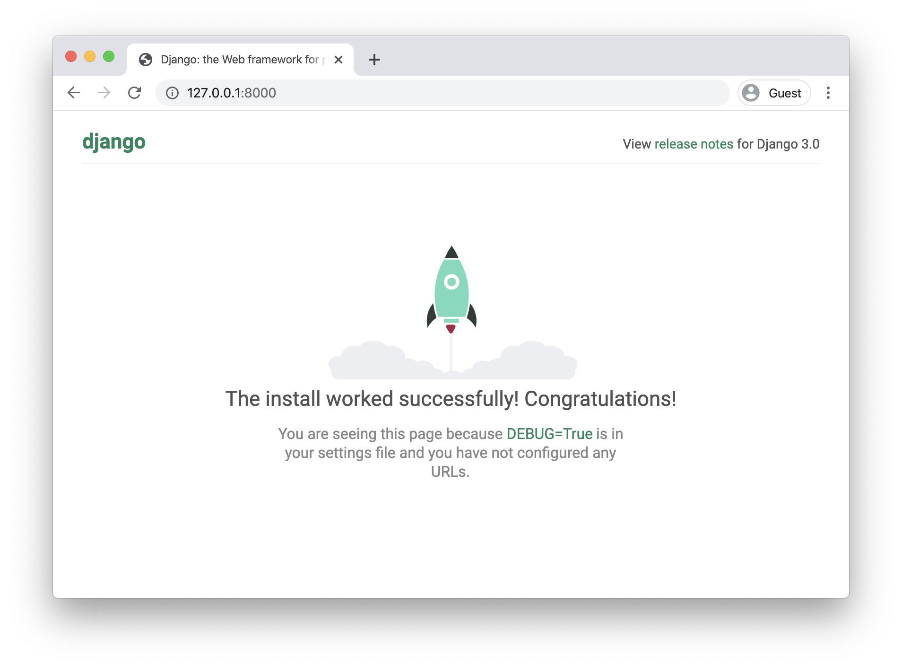

???

⏰ 03:00
---
class: middle, center, image
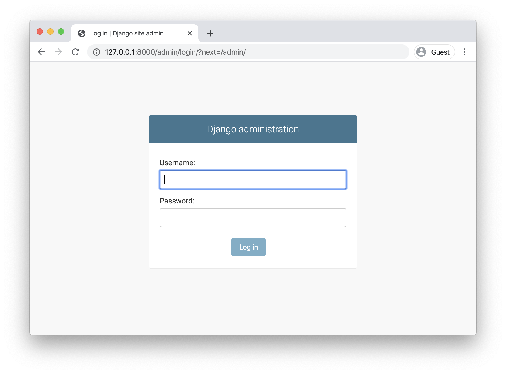
???

and we have the much loved django admin

---
class: title
# .prokyon[django]
## good local development story

???

we can get our app running locally really well.

and a lot of this boils down to
---
   
# .code[./manage.py runserver]

???

runserver does everything we need to in our local system.
---
   
# .code[./manage.py runserver]
### local web server
---
class: middle, center, image
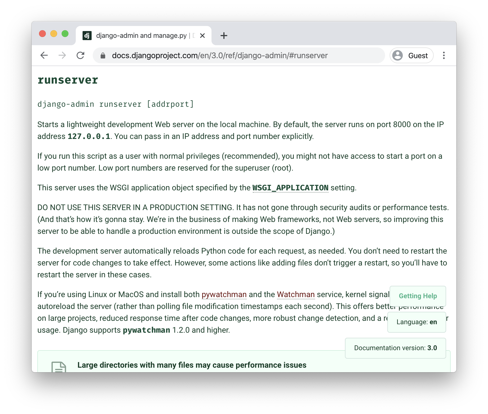
.footnotes[[➚](https://docs.djangoproject.com/en/3.0/ref/django-admin/#runserver)]
---
class: middle, center, image

.footnotes[[➚](https://docs.djangoproject.com/en/3.0/ref/django-admin/#runserver)]
???

As the documentation says

> runserver starts a lightweight development web server on your ocal machine.

But. And there's a big but.
---
class: middle, center, image
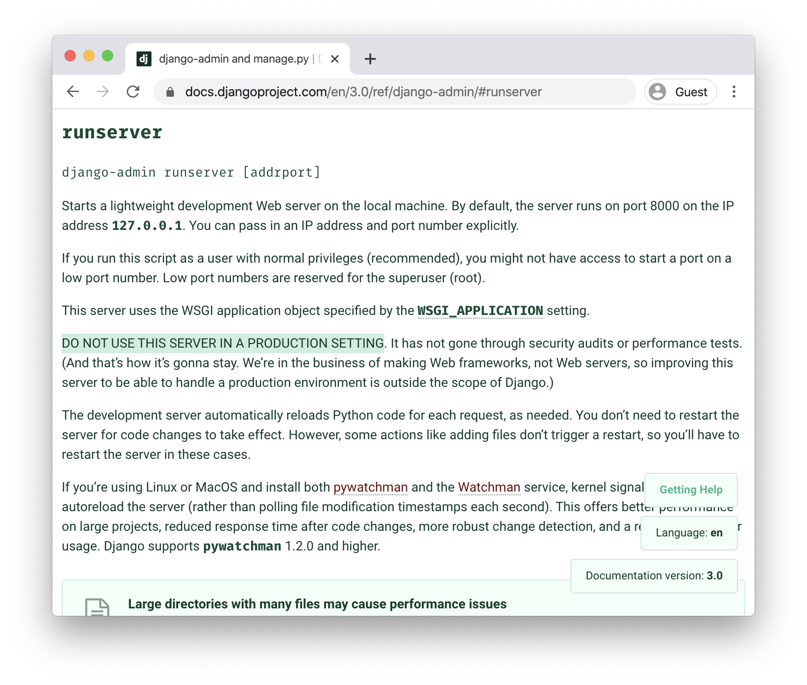
.footnotes[[➚](https://docs.djangoproject.com/en/3.0/ref/django-admin/#runserver)]
???

> do 👏 not 👏 use 👏 this 👏 server 👏 in 👏 a 👏 production 👏 setting.

---
class: middle, center, image

.footnotes[[➚](https://docs.djangoproject.com/en/3.0/ref/django-admin/#runserver)]

???

> It has not gone through security audits or performance tests. (And that’s how it’s gonna stay.

---
class: middle, center, image
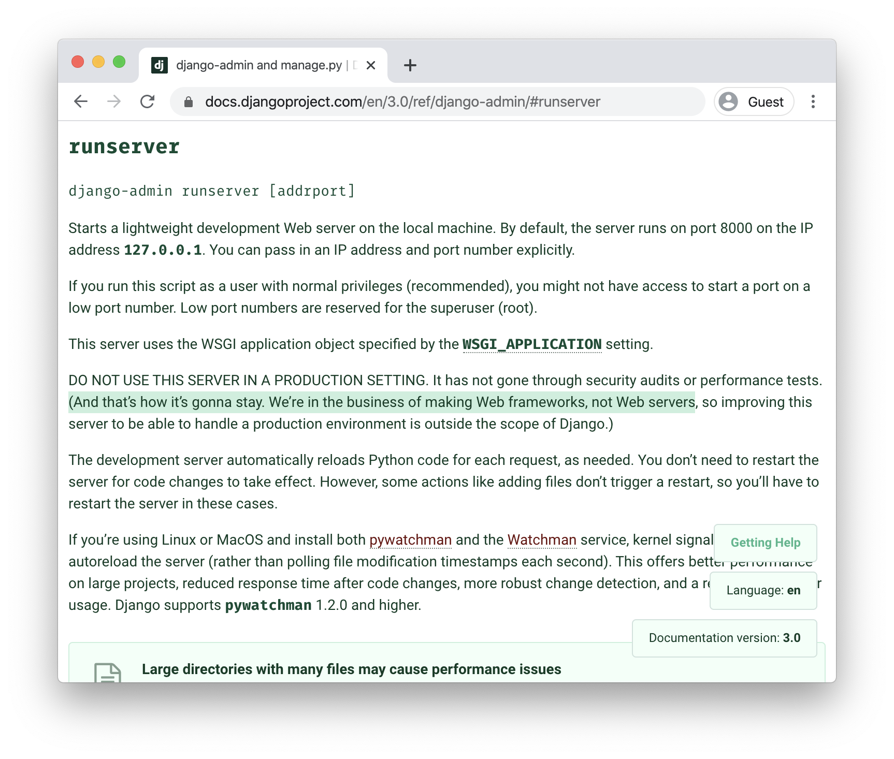

.footnotes[[➚](https://docs.djangoproject.com/en/3.0/ref/django-admin/#runserver)]

???
> We’re in the business of making Web frameworks, not Web servers

That deserves it's own slide
---
 
# .quote["We're in the business of making Web frameworks, not Web servers"]
### - .prokyon[django] documentation
???

⏰ 04:00

I want to pull this out and elaborate.

Django is an extremely stable, production ready, web framework.

Django is very good at being a web framework.

The fact that it provides any local web server functionality at all is amazing, but the fact that it calls out that it's not for production is also very very good.

We'll discuss a selection of webservers you should use in production a bit later.

But, there are a few new terms that we've just hit that we should take time to clarify.
---
class: title
# *What* is production, anyway?

???
What is production, anyway?

well, production is the live environment.

But

---

class: title
# Why is it called "production"?

???

why is it called production, anywy?

PAUSE

I've asked this question to a bunch of python practioneres, many of whom have a decade or more of experience

And the question leaves them thinking.

_ _Riff here_ _

1950's paper comparing to a production line.

In the current web sense, you could compare it to a theatre production.

_ _End riff_ _

Another term we came across.

---
class: title
# What is a web server, anyway?
???

⏰ 05:00

Also, what is a web server?

Thankfully this one is more aptly named.

A web server serves websites.

There are local web servers, like runserver, or there are production-grade web servers, that we'll discuss later.

The website is the service that responds when you enter a website URL into your browser, and deals with the HTTP protocol, handshakes, content types, .

---
   
# .code[./manage.py runserver]
### local web server + static server
???

Runserver is our local web server, but runserver also handles serves our static.
---
class: title
# What is "static", anyway?

???

⏰ 06:00

Static, assets, or static assets

refers to the unmoving parts of our web site, relative to the dynamic parts.

Assets miight be pictures, video, uploaded user files

that we can store locally on disk and serve as we need them.

And looking at the docs, we can see

---
class: middle, center, image

.footnotes[[➚](https://docs.djangoproject.com/en/3.0/howto/static-files/#serving-static-files-during-development)]
???

that if we are using django contrib staticfiles
---
class: middle, center, image

.footnotes[[➚](https://docs.djangoproject.com/en/3.0/howto/static-files/#serving-static-files-during-development)]

???
with debug enabled

that runserver will act as our staticfile server.

we can confirm this is the case with our default django projkect.

---

bash

<ps>myrtle</ps> <dr>~/git/glasnt/myproject $</dr>
<w>&nbsp;</w>
???

back in our terminal
---

bash

<ps>myrtle</ps> <dr>~/git/glasnt/myproject $</dr>
cat myproject/settings.py |grep staticf<w>&nbsp;</w>
???

we can check for that staticfiles reference in our settings
---

bash

<ps>myrtle</ps> <dr>~/git/glasnt/myproject $</dr>
cat myproject/settings.py |grep staticf 
&nbsp; &nbsp; 'django.contrib.staticfiles', 
<ps>myrtle</ps> <dr>~/git/glasnt/myproject $</dr>
<w>&nbsp;</w>

???

which is there
---

bash

<ps>myrtle</ps> <dr>~/git/glasnt/myproject $</dr>
cat myproject/settings.py |grep staticf 
&nbsp; &nbsp; 'django.contrib.staticfiles', 
<ps>myrtle</ps> <dr>~/git/glasnt/myproject $</dr>
cat myproject/settings.py | grep DEBUG<w>&nbsp;</w>

.lownote[[Django settings in production](https://djangochat.com/episodes/deployments), W. Vincent]

???

and our DEBUG setting
---

bash

<ps>myrtle</ps> <dr>~/git/glasnt/myproject $</dr>
cat myproject/settings.py |grep staticf 
&nbsp; &nbsp; 'django.contrib.staticfiles', 
<ps>myrtle</ps> <dr>~/git/glasnt/myproject $</dr>
cat myproject/settings.py | grep DEBUG 
DEBUG = True 
<ps>myrtle</ps> <dr>~/git/glasnt/myproject $</dr>
<w>&nbsp;</w>

.lownote[[Django settings in production](https://djangochat.com/episodes/deployments), W. Vincent]

???

which is true by default.
---
class: middle, center, image

.footnotes[[➚](https://docs.djangoproject.com/en/3.0/howto/static-files/#serving-static-files-during-development)]
???

but, as with the runserver, there's a note telling us
---
class: middle, center, image
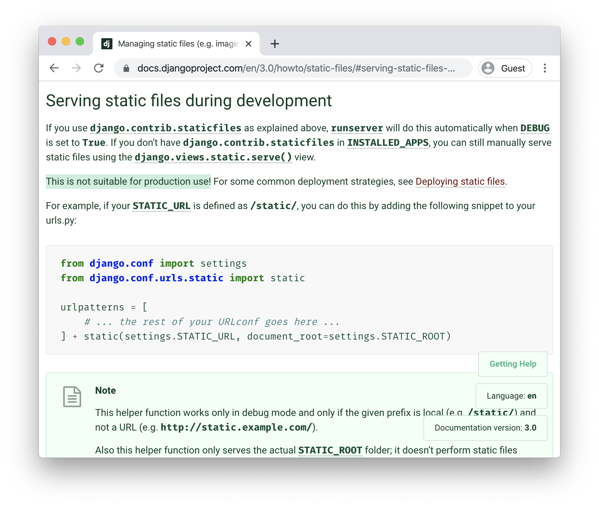
.footnotes[[➚](https://docs.djangoproject.com/en/3.03.03.03.03.03.03.03.03.0ving-static-files-during-development)]
???

> this is not for production use.

This is a helper for local development, so we'll need to substitute with something production grade later on,.

While we're also looking at our default settings file for our other helper
---
   
# .code[DATABASES]
### default: sqlite

???

⏰ 07:00

the default for our database has already been set for a local sqlite database.

---

bash

<ps>myrtle</ps> <dr>~/git/glasnt/myproject $</dr>
ls -R 
.: 
db.sqlite3 manage.py myproject 
 
./myproject: 
__init__.py asgi.py settings.py urls.py wsgi.py 
<ps>myrtle</ps> <dr>~/git/glasnt/myproject $</dr>
<w>&nbsp;</w>
???

We saw this earlier in our files.
---

bash

<ps>myrtle</ps> <dr>~/git/glasnt/myproject $</dr>
ls -R 
.: 
.red[db.sqlite3] manage.py myproject 
 
./myproject: 
__init__.py asgi.py settings.py urls.py wsgi.py 
<ps>myrtle</ps> <dr>~/git/glasnt/myproject $</dr>
<w>&nbsp;</w>
???

That automatically created db.sqlite3 file

That's our development database.

---

bash

<ps>myrtle</ps> <dr>~/git/glasnt/myproject $</dr>
ls -R 
.: 
db.sqlite3 manage.py myproject 
 
./myproject: 
__init__.py asgi.py settings.py urls.py wsgi.py 
<ps>myrtle</ps> <dr>~/git/glasnt/myproject $</dr>
cat myproject/settings.py | grep sqlite -C2<w>&nbsp;</w>
???

if we take a look at our settings

---

bash

<ps>myrtle</ps> <dr>~/git/glasnt/myproject $</dr>
ls -R 
.: 
db.sqlite3 manage.py myproject 
 
./myproject: 
__init__.py asgi.py settings.py urls.py wsgi.py 
<ps>myrtle</ps> <dr>~/git/glasnt/myproject $</dr>
cat myproject/settings.py | grep sqlite -C2 
DATABASES = { 
&nbsp; &nbsp; 'default': { 
&nbsp; &nbsp; &nbsp; 'ENGINE': 'django.db.backends.sqlite3', 
&nbsp; &nbsp; &nbsp; 'NAME': os.path.join(BASE_DIR, 'db.sqlite3'), 
&nbsp; &nbsp; } 
} 
<ps>myrtle</ps> <dr>~/git/glasnt/myproject $</dr>
<w>&nbsp;</w>
???

this was created due to the default DATABASES setting where sqlite is defined as the default backend.

---

class: middle, center, image
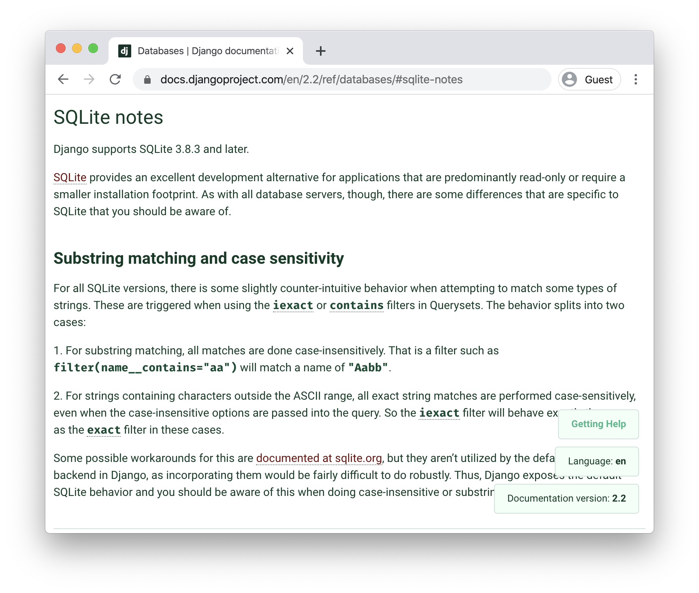
.footnotes[[➚](https://docs.djangoproject.com/en/3.0/ref/databases/#sqlite-notes)]
???

and, again, as per the documentation, sqlite is great in a

---
class: middle, center, image

.footnotes[[➚](https://docs.djangoproject.com/en/3.0/ref/databases/#sqlite-notes)]
???

development environment.
---
   
# .prokyon[django]
## ease of use in development
???

django a really good development story

but all the helpers we used in development cannot and should not be used
in production.

so we can't use any of these helpers
---

   
# .prokyon[django]
## complex in production

???

which makes our production use.. complex.

not complicated, but just complex.

django doesn't provide you with a webserver or database that's production ready

So you have to provide your own.

And if you aren't familiar with the production-grade offerings here, you'll end up confused.

Or worse, leaning towards using the development systems in production.

However,

Now is an important time to mention something important.

---
   
# .poly[Flask]
## simpler in production .h3[(comparatively)]
???

⏰ 08:30

Compare the out of the box functionality of django to something like flask

A lot of tutorials you see out there that say

"How to deploy python in production!"

Often use flask as the target.

Just copy up your code somewhere and run. Easy!

This is because of one simple fact
---
class: title
# .big[state]

???

state.

django is a stateful application. It has a database out of the box and static assets.

Flask, by default, does not. The sample "Hello world" doesnt' require a database or images, so it's so simpler to deploy.

---

   
# stateful applications
## complex in production

???

⏰ 09:00

any application that has state is complex in production.

This is why I chose to use django for my context

If I'd chosen flask, the discussion of deployment could be **really easy**

buyt it's not just django; any time you care about persistence you add complexity to your deployments.

And, funnily enough, this is also mentioned in the docs

---
class: middle, center, image
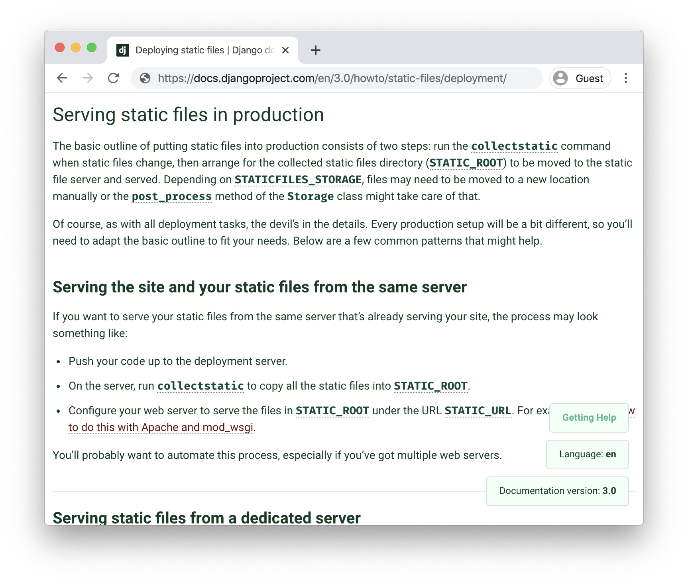
.footnotes[[➚](https://docs.djangoproject.com/en/3.0/howto/static-files/deployment/#serving-static-files-in-production)]

???

This section which discusses static deployment has this **wonderful gem**

---

class: middle, center, image
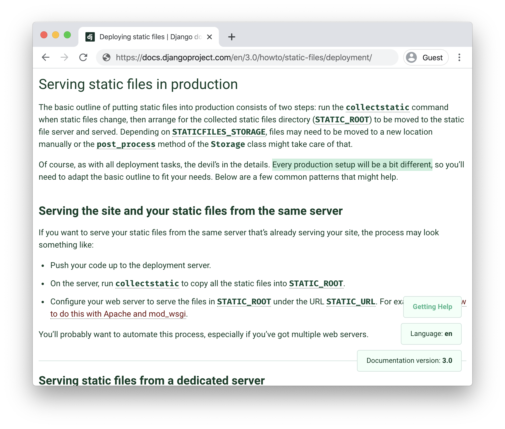
.footnotes[[➚](https://docs.djangoproject.com/en/3.0/howto/static-files/deployment/#serving-static-files-in-production)]

???

every production setup will be a bit different.

---

class: title
# .quote["Every production setup will be a bit different"]
### - .prokyon[django] documentation
???
I'm not sure who added this line to the documentation

which has been in the docs for a decade at this point

but whoever it was was such a smart cookie.

This is so so important.

So important it's on it's own slide.

But this statement is so so true.

---

class: title
# .quote["It depends."]
### - every deployment talk ever

???

⏰ 10:00

Nearly every talk I've seen on deployment includes a line like

it depends

When trying to tell you the "one true way" to do django deployments. Heck, I've seen a talk with this exact title.

Because it's true.

But I'm not going to use that line. I'm going to use another one.

---

class: title
# .quote["I'm a sysadmin, I'm not your sysadmin."]
### - @glasnt

???

I prefer this line.

I'm a sysadmin, I'm not your sysadmin.

being a play on the line "I'm a lawyer I'm not your lawyer".

I've been a sysadmin, operations engineer, SRE, whatever you want to call it

on and off for nearly the last decade.

I've worked for

... web hosting providers

... platforms as a service

and now

infrastructure as a service.

And each and every deployment is different and unqiue and beautiful and complex.

---
  
# to deploy a stateful app:
???

and for any stateful application, you have at the bare minimum three major segments
---
  
# to deploy a stateful app:
## run web framework
???

you need a way to run the web framework, whatever it is

---
  
# to deploy a stateful app:
## run web framework connect to a database
???

a way to connect to your database
---
  
# to deploy a stateful app:
## run web framework connect to a database serve static files
???

and a way to serve whatever static apps you have.

this exact trifecta is the same for Django.
---
  
# to deploy .prokyon[django]:
## run django connect to a database serve static files
???

⏰ 11:00

you need to run the web framework, connect to a database, and serve the static.

These are the same requirements are for any stateful application

Therefore, we can explore what a stateful application deployment means without
having to keep outselves within django itself

But, thankfully for us using django, we have some helpers.

---
  
# .prokyon[django] helpers
## WSGI .c[./manage.py migrate] .c[./manage.py collectstatic]

???

in order they are wsgi compatitbility, the migrate command, and the collect static command.

The rest of this talk will be describing how these helpers work.

Which will help us in exploring the options we have for deployment
---
  
# to deploy .prokyon[django]:
## run django connect to a database serve static files

???

so first item to get sorted to deploy our django app

---
  
# to deploy .prokyon[django]:
## **run django** connect to a database serve static files

???

running django itself
---
class: title
# WSGI
## Web Server Gateway Interface
### 🔊 *ˈ(h)wiskē*

???

WSGI is an acronym for

the web server gateway interface

and is python standard for web servers

Yeah, but, like...

---

class: title
# What *is* "WSGI", anyway?

???

⏰ 12:00

WSGI is a standard interface for python applications to talk to a webserver.

The standard was proposed back in 2003 as PEP-333, as a prompt to standardaise the interface between web servers and python web frameworks.

It allows us to choose any web server we want that understands WSGI and use it with Django

---
class: middle, center, image
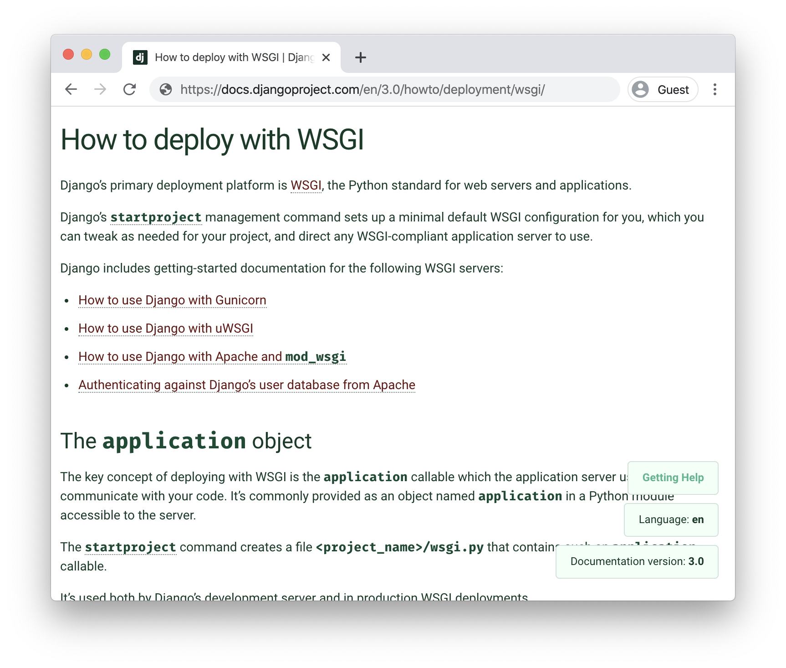
???

again, as per the docs

i love the docs

django's primary deployment platform

is wsgi

TODO(glasnt) There is a new one coming *SPOILERS* 😁 (...)

But WSGI is whata we care about now.

---
class: middle, center, image
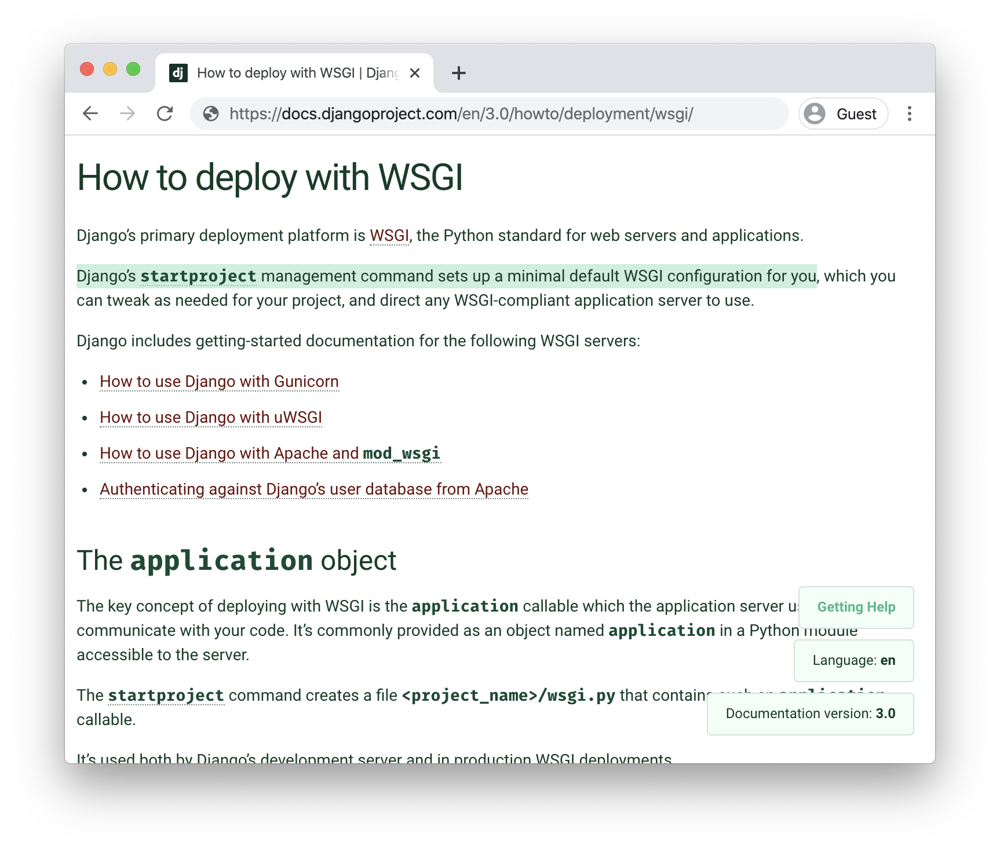

???

but as noted: the start project command sets up a simple default WSGI condig for you.

Which we can see from our project earlier.

---

bash

<ps>myrtle</ps> <dr>~/git/glasnt/myproject $</dr>
ls -R 
.: 
db.sqlite3 manage.py myproject 
 
./myproject: 
⎽⎽init__.py asgi.py settings.py urls.py wsgi.py 
<ps>myrtle</ps> <dr>~/git/glasnt/myproject $</dr>
<w>&nbsp;</w>

???

again, looking at those default files that were created.
---

bash

<ps>myrtle</ps> <dr>~/git/glasnt/myproject $</dr>
ls -R 
.: 
db.sqlite3 manage.py myproject 
 
./myproject: 
⎽⎽init__.py asgi.py settings.py urls.py .red[wsgi.py] 
<ps>myrtle</ps> <dr>~/git/glasnt/myproject $</dr>
<w>&nbsp;</w>

???

we can see the default created WSGI file
---

bash

<ps>myrtle</ps> <dr>~/git/glasnt/myproject $</dr>
ls -R 
.: 
db.sqlite3 manage.py myproject 
 
./myproject: 
⎽⎽init__.py asgi.py settings.py urls.py wsgi.py 
<ps>myrtle</ps> <dr>~/git/glasnt/myproject $</dr>
cat myproject/wsgi.py<w>&nbsp;</w>

???

the contents of which...
---

bash

WSGI config for myproject project.  It exposes the WSGI callable as a module-level variable named 'application'. For more information on this file, see https:.noop[/]/docs.djangoproject.com/en/3.0/howto/deployment/wsgi/ """ import os  from django.core.wsgi import get_wsgi_application  os.environ.setdefault('DJANGO_SETTINGS_MODULE', 'myproject.settings')  application = get_wsgi_application() 
<ps>myrtle</ps> <dr>~/git/glasnt/myproject $</dr>
<w>&nbsp;</w>

.lownote[[Hacking on the HTTP handlers and middleware](https://2019.djangocon.us/talks/using-django-as-a-micro-framework-on-the/) C. Gibson]

???

There's a full talk which dives into what this script

but in essense

it means we can choose any WSGI web server

and django will work.

---

class: title
# Deploy a .prokyon[django] app with a WSGI webserver
---

class: title
# WSGI webservers:
## .nl[[uWSGI](https://uwsgi-docs.readthedocs.io/en/latest/)]
## .nl[[gunicorn](https://gunicorn.org)]

.footnotes[[Type UWSGI, Press Enter, what happens?](https://www.youtube.com/watch?v=YoUZIzPGKT8) P. James, [Secrets of a WSGI master](https://www.youtube.com/watch?v=CPz0s1CQsTE) G. Dumpleton]
???

some of the options you have include microwsgi and gunicorn

Both of these webservers have their own cache of documentation, talks, and resources, which my slides link to.

---

class: title
# How do you deploy WSGI webserver?

???

but how do you deploy a wsgi websever

There are so many options

and what you choose is going to dictate some of the options available to you later.
---
class: title
# .so[How do you deploy WSGI webserver?]
???

but I have a better question

---
  
## How much custom infrastructure do you want?
???

⏰ 14:00

how much custom infrastrcutre do you want?

Because as we saw before, every production setup is a bit different

but there are plenty of options out there for you if you want to use a template that works for
80% of cases

and if you only have a standard django app, then these are going to work for you.
---

  
## .so[How much custom infrastructure do you want?]
???

and probably more importantly.
---
  
## How much infrastructure management do you want to do yourself?

???

how much infrastrcutre management do you want to do yourself?

If you are a django developer, then you probably want to develop django

you don't want to be spending your time trying to manage your infrastrcture

it's super interesting, sure, to setup your own physical server, your own network, your own server, your own redunant power, your own everything.

but when you want is just to get your application online, then why not pay someone who has spent the time to setup a way that works for 80% of websites

In our setup, we don't have anything custom, and we don't have any strong opinions about anything (yet), so why not let someone else manage things for you?

put in more simpler terms

---
class: title
## What do you want to worry about?

???

what do you want to worry about

~first instance, pause~

As a sysadmin, I got paid to worry.

You are a developer. A little worry is good, but thankfully,

you can pay to take your worry away.

---

class: title
# Managed hosting:
## Platform as a Service
## Infrastructure as a Service
.footnotes[* non-exhaustive]

???

in the managed hosting world, for the complexity of project we're talking about, there are two major options

PaaS and IaaS
---

class: title
# Managed hosting:
## PaaS
## IaaS
.footnotes[* non-exhaustive]

???

you'll often seen these abbreviated as Paas or IaaS, because words are getting long and we're busy technologists.

And yes, this is non-exhaustive. Within the scope of deploying a django application, these are the two major options.
---

class: title
# Other options:
## ~~Custom hardware~~
## ~~Functions as a Service~~

???
You could go as detailed as running your app on a server you have in your own home or business ("on-prem") (that make your own everything scenario I mentioned earlier)

or trying to squeeze django into a function as a service,

but these are the 20% of cases. The non-standard cases.

I'm going to focus on the ones that are much more suited for django, and more suited to our unopinionated django app

---
  
# Platform as a Service
### worry about: your .prokyon[django] app, data

.footnotes[Example providers: Heroku, Divio, Google Cloud, PythonAnywhere]

???

in general your platforms as service are going to be places where you provide your code to them, often fit to some sort of template, which normally includes the command to run to get your app working. This will often be uwsgi or guniconr

---
  
# Platform as a Service
### managed for you:  web server, operating system, hardware, storage, networking...
.footnotes[Example providers: Heroku, Divio, Google Cloud, PythonAnywhere]

???

the things that will be managed for you include the web server (often included in whatever template you have), the operating system, the physical hardware, the storage, networking, and a whole host of other things.

On the otherhand, if you have opinions about some of the earlier elements in this, you can jump down into
---
  
# Infrastructure as a Service
### worry about: your .prokyon[django] app, data web server, operating system
.footnotes[Example providers: Google Cloud, Amazon Web Services, Azure]
???

IaaS. Where you can worry about your web server and operating system.

Often as a container or some other sort of isolation model, but you do get a choice here.

---
  
# Infrastructure as a Service
### managed for you:  hardware, storage, networking...
.footnotes[Example providers: Google Cloud, Amazon Web Services, Azure]
???

and you pay for someone else to manage the hardware, storage, etc.

Now this is very very much an overgeneralisation, as there is an entire other talk on the complexities of infrastrcutre as a service.

but there is a reason I mentioned this
---
class: title
## What do you want to worry about?
???

what do you want to worry about

if you don't have an opinion, choose a platform as a service.

if you have opinions or requirements, choose infrastructure as a service.

---
  
# to deploy .prokyon[django]:
## run django connect to a database serve static files
???

our list of things we need to deploy a django app

---
  
# to deploy .prokyon[django]:
## .so[run django] connect to a database serve static files
???

we've covered one
---
  
# to deploy .prokyon[django]:
## .so[run django] **connect to a database** serve static files
???

And the next one is a database.
---
  
# db helpers:
## .code[./manage.py makemigrations ./manage.py migrate]

???
⏰ ~~17:00

these two management commands,

in my own personal opinion,

are two of the greatest features of django

Oh, I mean having a dynamic web admin is pretty sweet, but these two commands are just choice.
--

### created to reduce developer toil

???
The whole concept of automating the migration framework was design to reduce developer toil

the migrations framework is designed to create the required database commands in order to make your models into real tables.

---

bash

.cf[Operations to perform:] 
&nbsp; .tb[Apply all migrations:] admin, auth, contenttypes, sessions 
.cf[Running migrations:] 
&nbsp; Applying contenttypes.0001_initial... .gf[OK] 
&nbsp; Applying auth.0001_initial... .gf[OK] 
&nbsp; Applying admin.0001_initial... .gf[OK] 
&nbsp; Applying admin.0002_logentry_remove_auto_add... .gf[OK] 
&nbsp; Applying admin.0003_logentry_add_action_flag_choices... .gf[OK] 
&nbsp; Applying contenttypes.0002_remove_content_type_name... .gf[OK] 
... 
&nbsp; Applying auth.0009_alter_user_last_name_max_length... .gf[OK] 
&nbsp; Applying auth.0010_alter_group_name_max_length... .gf[OK] 
&nbsp; Applying auth.0011_update_proxy_permissions... .gf[OK] 
&nbsp; Applying sessions.0001_initial... .gf[OK] 
<ps>myrtle</ps> <dr>~/git/glasnt/myproject $</dr>
<w>&nbsp;</w>
???

These are the migrations we generated earlier

These are the base migrations for the base django data structures

ntenttypes <pre><code class=""></code></pre>

auth

admin

sessions

etc.

The contents of these files are used to generate SQL based on your database

---
class: title
# Which database?
???

so which databsae?
---

class: middle, center, image
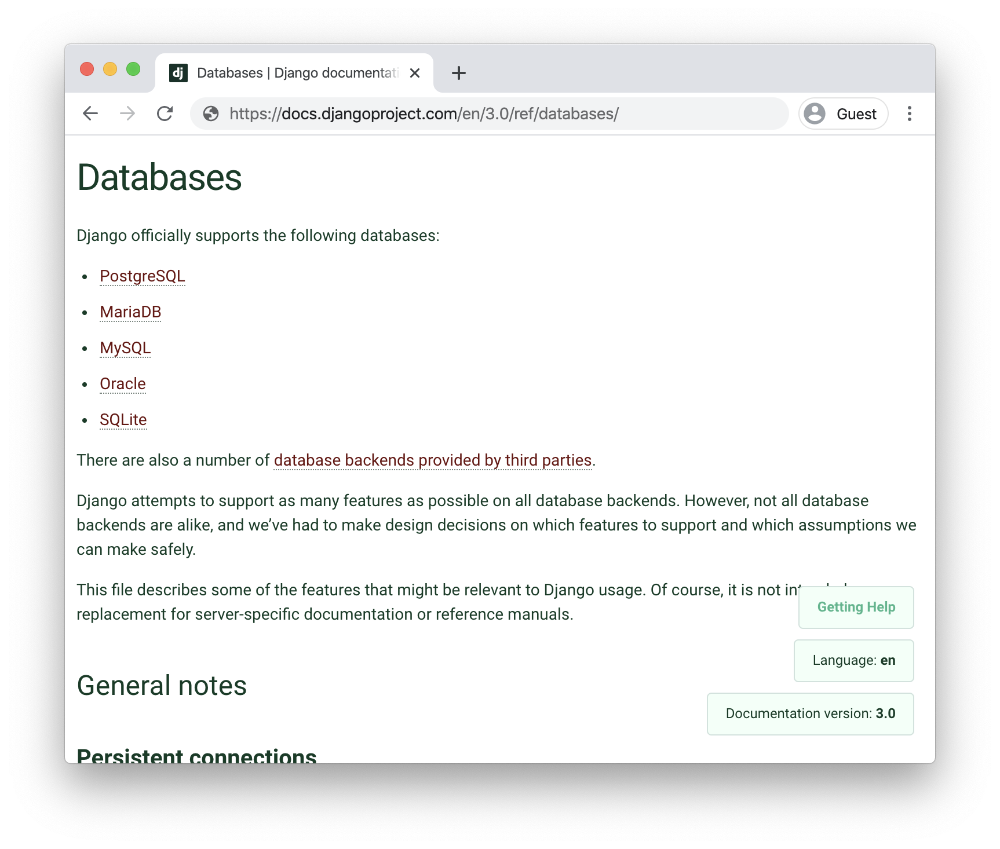
.footnotes[[➚](https://docs.djangoproject.com/en/3.0/ref/databases/)]

???

the docs are useful here

Because this (now) has a nice list of all the databases that are supported. However

---

class: middle, center, image
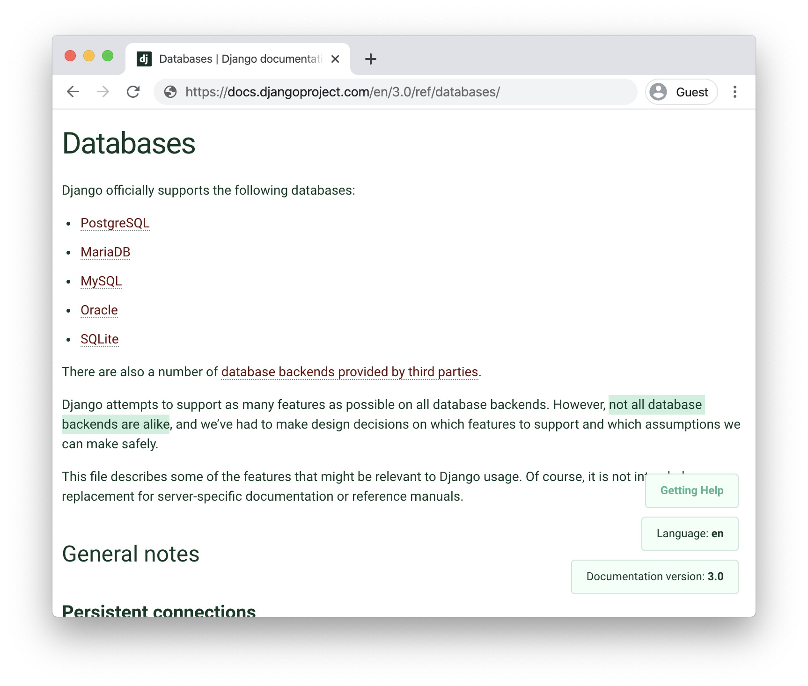

.footnotes[[➚](https://docs.djangoproject.com/en/3.0/ref/databases/)]

???

> Django attempts to support as many features as possible.

Django is a database agnostic framework.

It supports postgres, mariadb, mysql, oracle, and sqllite, but which database should you choose?

Again

---
class: title
## What do you want to worry about?

???

what do you want to worry about?

If you already have a database expert, choose the one they know.
If you have a preferred one, choose that.

Otherwise

---
   
### No opinion?
# Choose PostgreSQL.

???

choose postgresql

Shock I know right. I'm actually telling you something solid.

But it's not without reason.

---

class: middle, center, image

???

the docs specifically point this out.

---

class: middle, center, image

???

django is a database agnostic web framework

but

---

class: middle, center, image
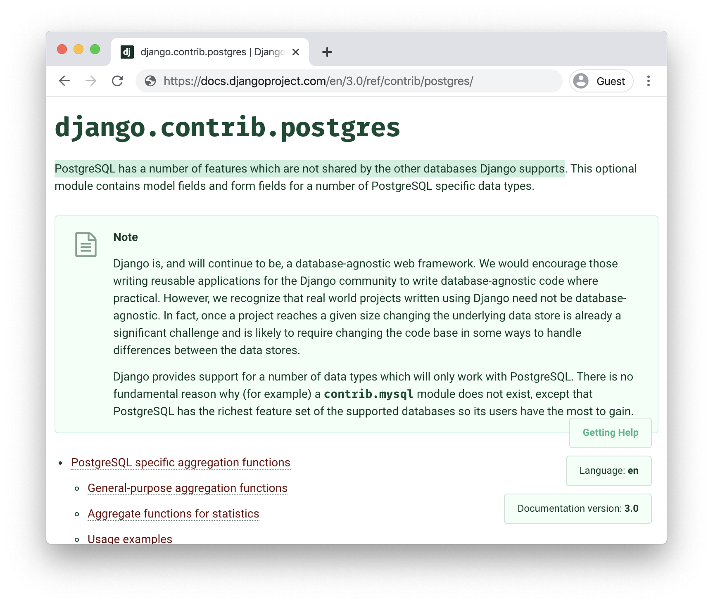

???

> PostgreSQL has a number of features which are not shared by the other databases Django supports.

The ability for other databases to have as much bredth in functionality is limited only by community contribution

at the time of recording, postgres has the most contribution

If you want your preferred database to have more support, help support it by writing the functionality :)
---
class: title
# Databases hosting

???

now that you've chosen your database, now you gotta host it.

There are a few options here.

You could setup one of your containers or VMs to be a postgres database, so you'd end up with two servers.

But again
---
class: title
## What do you want to worry about?

???

what do you want to worry about

are you a python developer, or a database administrator?

---
class: title
# Managed databases
## a.k.a. "DBaaS"

???

managed databases are just specalised "as a service"

which some people call "DBaaS" which I think is... a bit much.

however you want to define them

a lot of applications across a lot of programming languages and formats -- web, mobile, etc -- use database

so many infrastructure providers now offer managed databases.

---
  
## Managed databases
### worry about:  your data models
.footnotes[Example providers: your PaaS or IaaS provider]

???

In managed databases,

you define your data models in your app

and then
---

  
## Managed databases
### .prokyon[django] worries about: generating and applying migrations
.footnotes[Example providers: your PaaS or IaaS provider]
???

django handles making your datamodels into usable SQL for your database of choice.

You just have to run the migrate command.

---
  
## Managed databases
### managed for you: storage, backups, persistence, maintenance...

.footnotes[Example providers: your PaaS or IaaS provider]

???

and your managed datbase provider,

probably the same provider your web server uses

will handle everything about your databse for you.

And it's a good idea to have your web server and database located in the same network, physically close if at all possible.

This will help make sure they can talk to each other as quickly as possible.

Because you know

light only travels so fast.

your database host will often handle everyhitng from backups to storage (including scaling storage, which is often very good.

class: background-black

AND honestly.

---
  
## Managed databases
### A exceptionally good idea.

???

managed databases are a really good idea.

...

---
  
## Managed databases
### A exceptionally good idea. Even if they cost money.
???

⏰ ~20:00

Even if they cost you money.

Because at the end of the day, your website code is probably going to have a copy somewhere else

your laptop, github, whatever

but your user data

that's your only copy

so it's a really good idea to pay someone to store that properly.

and the ease that having someone else worry about maintenance and backups and heck, even zero down time disk size expanding...

And as someone who used to get paid to have to do this manually out of hours, this is a very very good feature to have!

For a django application hosted on, say, google cloud, or another cloud provider, your managed database may end up being your *only* cost.

what with all the free tiers and included credits and what not.

But paying for that piece of mind

it might just be worth it.

Okay, it might not be your only cost. Custom domain names, other non-free items, but we're not going to explore that complexity today.

---
class: title
# to deploy .prokyon[django]:
## .so[run django connect to a database] serve static files
???

and now to the last section in our deployment trifecta
---
class: title
# to deploy .prokyon[django]:
## .so[run django connect to a database] **serve static files**
???

serving staatic files.
---
class: title
# static helper:
## .code[./manage.py collectstatic]

???

the helper here is collectstatic

---

class: title
# static asset management
## an entire talk

.footnotes[["Assets in Django without losing your hair", J. Kaplan-Moss](https://www.youtube.com/watch?v=E613X3RBegI)]

???

this is literally an entire talk, and thankfully there was a talk focussing only on this at PyCon this year

---

class: title
# asset management options:

## simple assets cloud storage media uploads asset compilation
.footnotes[["Assets in Django without losing your hair", J. Kaplan-Moss](https://www.youtube.com/watch?v=E613X3RBegI)]

???

Jacob Kalplan-Moss details four scenarios,

simple assets

cloud storage

media uploads

and the more complex asset compilation

as ways of hosting static assets.

if you chose a chose a IaaS provider earlier, they probably offer some sort of cloud storage, which is super useful to have, again, to keep everything physically close.

If you went with the PaaS, perhaps the simple asset solution is for you.

---

class: title
# static options:

## cloud storage
### for static and media

???

out of all the tech I've discussed so far, cloud storage is the oldest and most solid

AWS S3 launched in 2006. That's 13 years ago.

storing media objects is a foundational service provided by any cloud provider.

and it's totally okay to use

the scariest thing when I first came across s3 was the fact that I had to use a global bucket name. Like, a name that had never been used before
but that's okay

the way this works means that the name must be unique for every reference

use this foundational service of the current internet age

and make sure that when you name your bucket it's not just your app's name or your internet name because once you use that name it's gone forever and you'll probably want to change your naming scheme at once point so if it's your first one just make sure it's not a super cool name.

ENDTODO

---

  
# to deploy .prokyon[django]:
## .so[run django connect to a database serve static files]
???

so we've covered each of the three major tenants.

So

---
class: title
# What is .prokyon[django] deployment, *anyway*?

???
⏰ 23:00

actually deploying.

we're finally there.

---
class: title
## [copy code to host] .c[./manage.py migrate] .c[./manage.py collectstatic] [start web server]

???

here it is.

~

.noop[c]opy your code to wherever you're hosting

run your two management commands

and start your web server, whichever that is.

~

I know. This doesn't seem like a lot.

But given the last XX minutes I spent describing all this, hopefully you now have a greater understanding of the complexity

of what needs to be done

but not how to do it, explicitly.
---

class: title
# The reason there's no one answer.

???

The main reason why there's no one answer on how do to do any of this

is because the way you do deployments, the way you setup production

has to be right for you

because you have to maintain it.

and if we tell you a solution, you may not like it, or understand it

which means you won't be able to maintain it

and that is far worse.

---
   
# Things I didn't mention
???

there's so much more to this topic that I just can't even hope to cover.
--

### continuous deployment, monitoring, scaling, logging, high availablilty, load balancing, secrets, orchestration, zero downtime deployments, blue/green deployments, A/B testing, containers, configuration management, automation...

???
Nearly each of these topics is their own entire *conference* worth of material.

And there are many many opinions about *when* to run the four commands I mentioned earlier.

But hopefuully I've been able to help you just see a bit behind the curtain of deployment.

And shown you that is it is complex, but not as complicated as you might think.

---
class: title
#  Thanks!
###  glasnt.com/talks  

???

I am sure there are many opinions that this talk has surfaced

so for the comfort of the audience and the next speaker

.noop[p]lease follow me out in to the hallway and we can have a chat.

I'm also available on email and twitter if you want to discuss more later.

Thank you for your time.